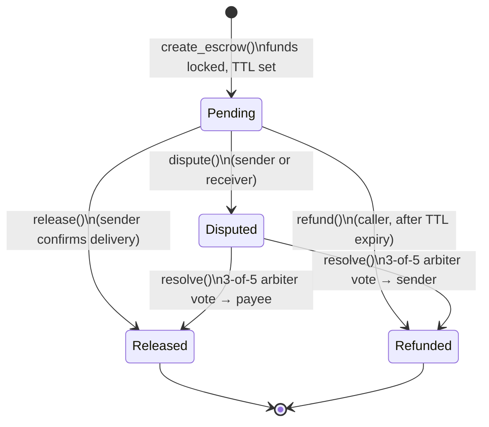
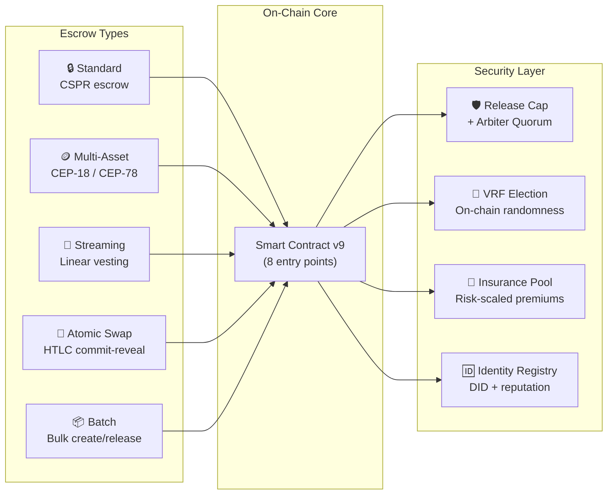
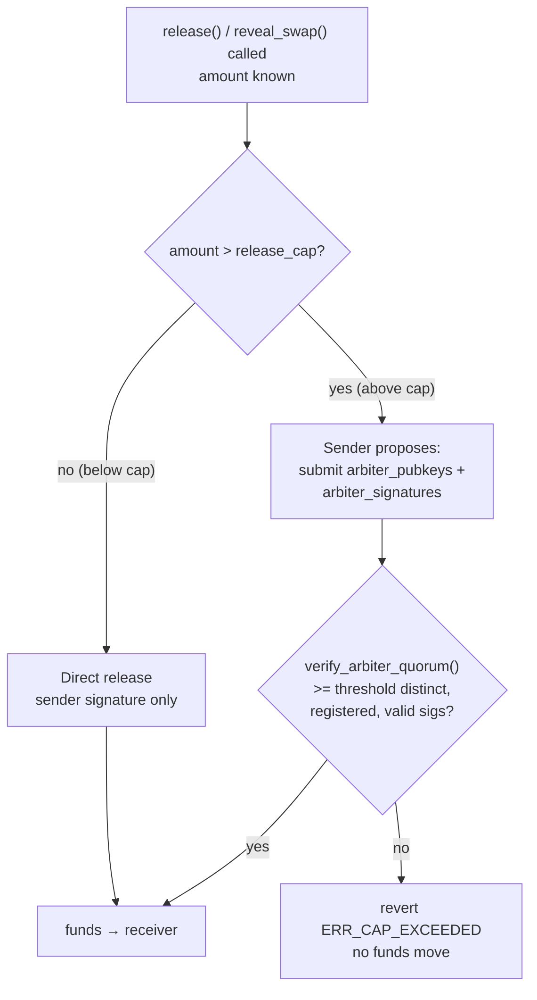
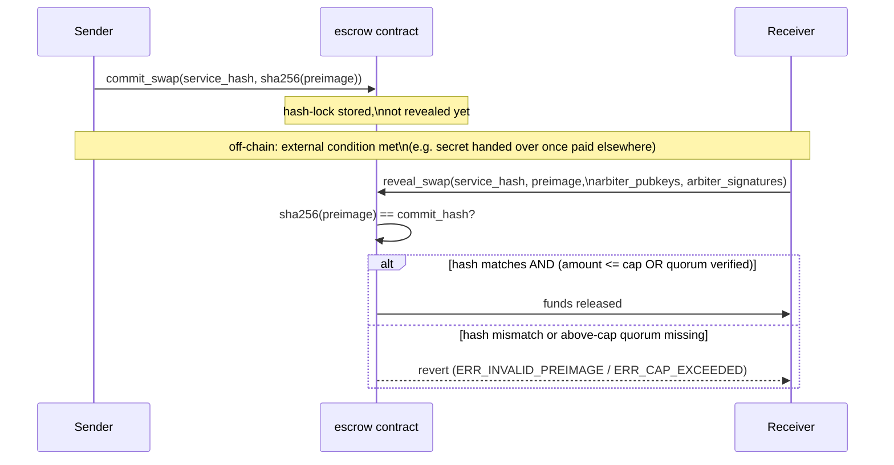
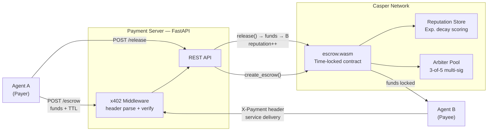
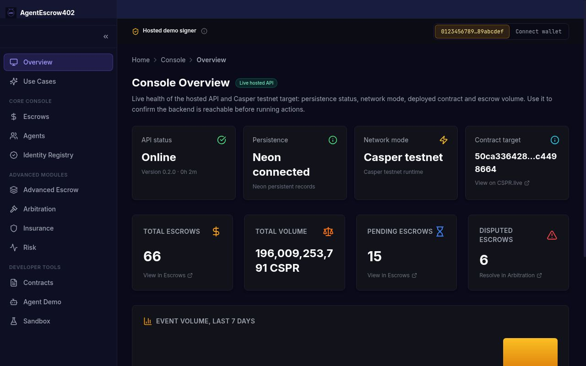
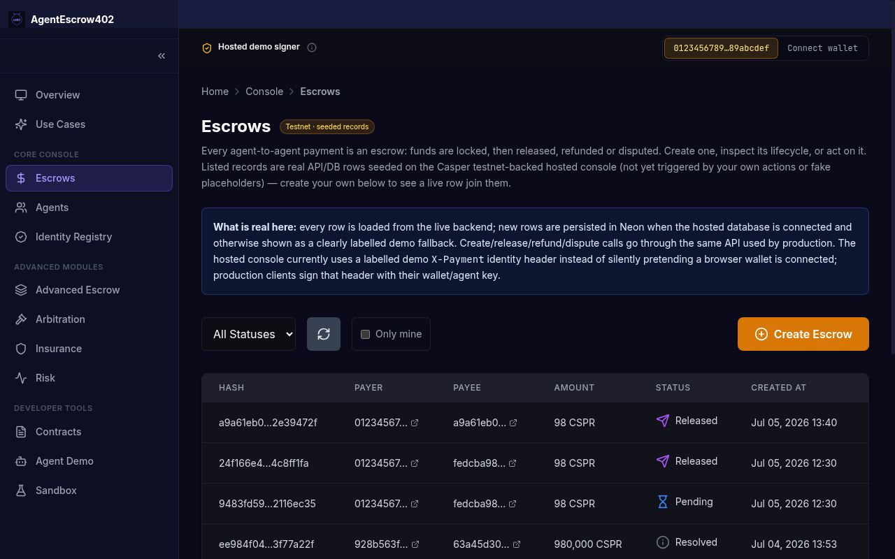
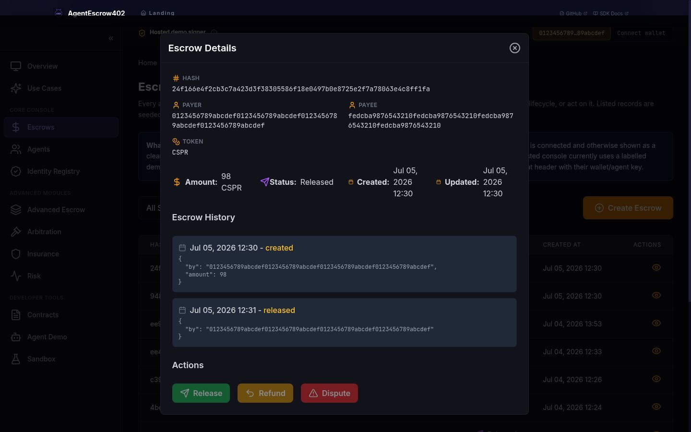
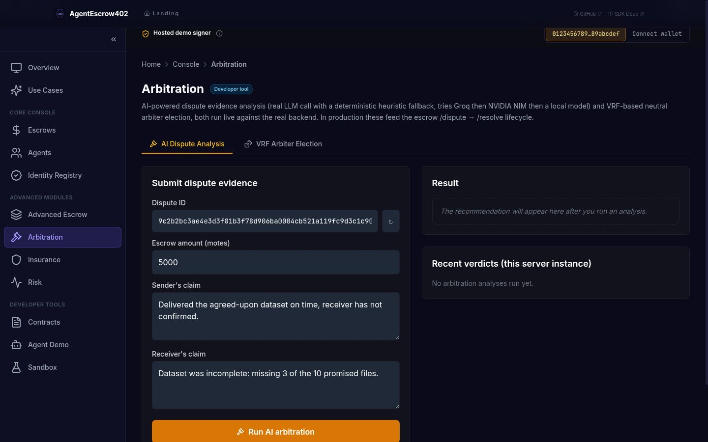

<a id="readme-top"></a>

<div align="center">

# AgentEscrow402

## HTTP 402 × Casper Network: autonomous escrow for AI-to-AI micropayments

*Agents pay agents. On-chain. No humans in the loop.*

[](https://github.com/alexbelij/AgentEscrow402/actions/workflows/ci.yml)
[](https://python.org)
[](https://testnet.cspr.live)
[](LICENSE)
[](https://ae402.xyz)
[](https://dorahacks.io/)
[](#-smart-contract)
[](#-testing)
[](docs/API_SDK_MCP.md)

[](https://ae402.xyz/console)

> 🟢 **TESTNET LIVE:** 369 confirmed on-chain deploys across escrow / HTLC / multi-asset / streaming · 10 contracts live on `casper-test` (14 total in `main`, 4 code-complete pending deploy — see [TX_MANIFEST.md](TX_MANIFEST.md)), cross-contract calls
> 📊 140 API endpoints · 26 MCP tools · 2085 Python + 250 Rust tests (property-based)
> 🎥 See [screenshots](#-screenshots) below and the [live demo](https://ae402.xyz/console) for an end-to-end walkthrough
> 🔍 Every claim below links to a runnable command or a verifiable on-chain tx — see [What is real vs. simulated](#-what-is-real-vs-simulated)

**[🚀 Live Demo](https://ae402.xyz)** · **[🎬 10-min walkthrough](docs/DEMO_SCRIPT.md)** · **[📐 Architecture](#-architecture)** · **[📡 API Reference](#-api-reference)** · **[SDK Docs](docs/SDK.md)**

**For agents & operators:** [Use AgentEscrow](https://ae402.xyz/console/escrows) — lock, release, dispute · **For developers:** [Build with AE402](https://ae402.xyz/console/docs) — API, Python SDK, MCP · **For evaluators:** [Evaluate the project](https://ae402.xyz/console/feature-map) — feature map with strict `On-chain / Live API / Local demo / Simulation / Planned` status labels

**New this round — try it live:** [Threshold Escrow (MPC)](https://ae402.xyz/console/sandbox) · [ZK Amount Privacy](https://ae402.xyz/console/sandbox) · [Gaming-Reward Escrow](https://ae402.xyz/console/sandbox) · [Multi-Hop A2A](https://ae402.xyz/console/sandbox) · [Casper↔EVM Bridge](https://ae402.xyz/console/advanced) · [Compliance Engine](https://ae402.xyz/console/sandbox) — all live in the sandbox, see [docs/DEMO_SCRIPT.md §7](docs/DEMO_SCRIPT.md) for runnable pytest commands

### One-command judge reproducibility

```bash
git clone https://github.com/alexbelij/AgentEscrow402
cd AgentEscrow402
make judge-demo    # boots local Casper 2.0 NCTL + deploys + runs full escrow lifecycle e2e
```

Boots a local Casper 2.0 network, deploys `escrow_funder.wasm`, and drives create→release + create→refund end-to-end. ~5 minutes on a clean clone. See [`docs/CASPER_PRIMER.md`](docs/CASPER_PRIMER.md) if you're new to Casper, [`docs/MOAT.md`](docs/MOAT.md) for the only-possible-on-Casper argument, and [`TX_MANIFEST.md`](TX_MANIFEST.md) for the live testnet contracts.

</div>

---

| | |
|---|---|
| 🌐 **Live App** | [ae402.xyz](https://ae402.xyz) |
| 🔗 **API** | [agentescrow402-api-ywm8.onrender.com](https://agentescrow402-api-ywm8.onrender.com) |
| 📜 **Contracts** | `612cead2...d9ec` ([view on testnet](https://testnet.cspr.live/contract/612cead2226329fafec492042fd96a999df06d1e88c476913a167f44d3ddd9ec)) |
| 🎥 **Demo Video** | _coming soon_ |
| 📚 **Docs** | [API](docs/API_SDK_MCP.md) · [SDK](docs/SDK.md) · [Architecture](docs/ARCHITECTURE.md) |
| 🧪 **Tests** | 450 functions · 70%+ coverage |
| 🏗️ **Contracts** | 8 deployed on Casper Testnet (v9) |

---

> [!IMPORTANT]
> **What this is:** A deployed Casper testnet escrow console for AI-agent payments: signed x402 payment intent, Casper deploys for escrow lifecycle calls, Neon-backed hosted records, IsolationForest risk scoring, ML-KEM metadata encryption, and VRF-assisted arbitration. Console live at [ae402.xyz](https://ae402.xyz); API live at [agentescrow402-api-ywm8.onrender.com](https://agentescrow402-api-ywm8.onrender.com).

<details>
<summary><kbd>Table of contents</kbd></summary>

- [What makes it unique](#-what-makes-it-unique)
- [How it works](#-how-it-works)
- [No-unilateral-withdraw guard](#-no-unilateral-withdraw-guard-release-cap--arbiter-quorum)
- [Quickstart](#-quickstart)
- [Architecture](#-architecture)
- [Screenshots](#-screenshots)
- [What is real vs. simulated](#-what-is-real-vs-simulated)
- [Use cases](#-use-cases)
- [Smart contract](#-smart-contract)
- [API reference](#-api-reference)
- [SDK and integrations](#-sdk-and-integrations)
- [Tech stack](#-tech-stack)
- [Testing](#-testing)
- [All documentation](#-all-documentation)
- [License](#-license)

</details>

---

## ✨ What makes it unique

The [x402 protocol](https://www.x402.org/) defines machine-to-machine payments via HTTP 402 headers. Existing implementations assume Ethereum facilitators. AgentEscrow402 brings the pattern to Casper Network with live testnet escrow calls plus a hosted console that labels what is on-chain, what is Neon-backed API state, and what is demo-signer convenience for browsers.

| Feature | AgentEscrow402 | Coinbase x402 | Manual invoicing |
|---|---|---|---|
| **Trustless on-chain escrow** | ✅ Time-locked WASM contract | ❌ Facilitator holds funds | ❌ N/A |
| **Reputation tracking** | ✅ Exponential decay, per-agent | ❌ None | ❌ None |
| **Multi-sig dispute resolution** | ✅ 3-of-5 arbiter vote | ⚠️ Facilitator decides | ⚠️ Manual |
| **Zero human facilitation** | ✅ Fully agentic | ⚠️ Needs setup | ❌ Always human |
| **Casper Network native** | ✅ WASM contract | ❌ EVM only | — |
| **Multi-asset escrow** | ✅ CSPR, CEP-18, CEP-78 (real on-chain) | ❌ Single asset | — |
| **Atomic secret-for-payment swap** | ✅ SHA-256 HTLC commit/reveal | ❌ Not supported | — |
| **AI-assisted dispute triage** | ✅ Evidence scoring feeds the arbiter vote | ❌ None | ❌ None |
| **Sybil-resistant agent identity** | ✅ DID registry, staking + slashing | ❌ None | — |
| **Post-quantum metadata confidentiality** | ✅ ML-KEM-768 hybrid encryption | ❌ None | — |
| **Confidential/private amounts (ZK)** | ✅ Two complementary layers — [on-chain fraud-dispute range proofs](docs/RANGE_PROOFS.md) + [off-chain confidential-amount escrows](docs/ZK_AMOUNT_PRIVACY.md) | ❌ None | ❌ None |
| **Multi-hop A2A choreography** | ✅ Chained agent-to-agent escrows (A→B→C→...) under one auditable `parent_intent_id`, tamper-evident `chain_root_hash` — anchored on-chain via `escrow-manager.link_escrows` (append-only, zero fund movement) so a judge can trustlessly verify the choreography end-to-end. See [API reference](#-api-reference). | ❌ None | ❌ None |
| **Production maturity / ecosystem adoption** | ⚠️ Hackathon-stage, testnet only | ✅ Live, mainnet, adopted by real facilitators | ✅ Universally understood |

See [what's real vs. simulated](#-what-is-real-vs-simulated) for exactly which of these are live
on-chain today versus API-level.

<div align="right"><a href="#readme-top">↑ back to top</a></div>

---

## ⚙️ How it works

Four steps, no human signature required mid-flow (see [verified on-chain transactions](#-testing)
and [what's real vs. simulated](#-what-is-real-vs-simulated) for the exact scope of that claim).

1. **Agent A creates escrow** — locks funds in a time-locked Casper contract with a TTL and service hash
2. **Agent B verifies payment** — checks the x402 header against the on-chain escrow before serving work
3. **Agent A releases** — confirms delivery; funds transfer to Agent B; reputation score updates
4. **Timeout protection** — if Agent B never delivers, Agent A reclaims funds after TTL expires; no arbiter needed

```
Agent A                    Payment Server                 Casper Network
  │                            │                              │
  ├─ POST /escrow ────────────▶│                              │
  │  {receiver, amount, ttl}   │── create_escrow() ─────────▶│
  │                            │                              │ funds locked
  │◀── 201 {service_hash} ────┤                              │
  │                            │                              │
  ├─ GET /api/compute ────────▶│                              │
  │  X-Payment: x402-v1;...    │── verify header ───────────▶│
  │                            │◀─ ok ──────────────────────┤
  │◀── 200 result ────────────┤                              │
  │                            │                              │
  ├─ POST /release ───────────▶│── release() ───────────────▶│
  │  {service_hash}            │                              │ funds → Agent B
  │◀── 200 ───────────────────┤  reputation updated on-chain │
```

**x402 header format:** `X-Payment: x402-v1;<escrow_hash>;<amount>;<sender>;<timestamp>;<nonce>;<signature>`

Protected endpoints return `402 Payment Required` with machine-readable terms when the header is missing.

This is the base happy-path lifecycle. The dispute-resolution vote, HTLC atomic-swap
commit/reveal, and multi-asset (CEP-18/CEP-78) flows each have their own diagram in
[docs/ARCHITECTURE.md](docs/ARCHITECTURE.md) rather than being crammed into this one.

Every escrow moves through the same on-chain states regardless of which exit path it
takes — created, then released, refunded, or disputed → resolved:


*Text fallback: an escrow starts `Pending`; it exits via `release` (seller paid),
`refund` (TTL expired, nobody delivered), or `dispute` → 3-of-5 arbiter `resolve`, which
routes funds to either side. `commit_swap`/`reveal_swap` is a variant exit on the same
`Pending` state — see the [HTLC atomic-swap flow](#-use-cases) below.*

### Full product scope

All escrow types share the same on-chain core but add specialised flows on top:



<div align="right"><a href="#readme-top">↑ back to top</a></div>

---

## 🛡️ No-unilateral-withdraw guard: release cap + arbiter quorum

The escrow contract's `sender` key is *not*, by itself, sufficient authorization to move
funds above a configurable cap. This is enforced on-chain in
[`contracts/escrow/src/main.rs`](contracts/escrow/src/main.rs), not in the API layer:

- A `release_cap` named key (`RELEASE_CAP_KEY`) defaults to `1_000_000_000_000` motes = **1,000
  CSPR** (`DEFAULT_RELEASE_CAP_MOTES`) and is retunable on-chain via `set_release_cap`
  (installer-only) with no redeploy needed.
- Both fund-releasing entry points — `release()` and `reveal_swap()` (the HTLC path below) —
  call `read_release_cap()` and compare it against the escrow amount. Below the cap, the
  sender's own signed call is enough, exactly like today's happy path.
- **Above the cap, the sender's signature alone is rejected.** The caller must additionally
  supply `arbiter_pubkeys`/`arbiter_signatures` covering a canonical
  `"release:<service_hash>:cap_approval"` (or `"reveal_swap:..."`) message.
  `require_arbiter_cap_approval()` → `verify_arbiter_quorum()` checks that at least
  `threshold` (default 3, same registered-arbiter list `resolve()` uses) **distinct,
  registered** arbiters produced valid Ed25519 signatures over that exact message — dedup'd,
  so one arbiter can't sign twice to fake a quorum. Fail the quorum check and the call
  reverts with `ERR_CAP_EXCEEDED`; no funds move.
- In other words: **propose → arbiter-quorum approve → release**, not **agent key → release**,
  for anything above the cap. A compromised or malicious agent key can drain at most the
  cap amount unilaterally; anything larger requires collusion or compromise of a majority of
  the independently-held arbiter keys.
- Confirmed on the deployed v9 contract: the `resolve` (3-of-5 multisig) gas-benchmark entry
  in [docs/GAS_BENCHMARK.md](docs/GAS_BENCHMARK.md) measures the same signature-verification
  code path this guard reuses (~7.5 CSPR gas for 3 on-chain Ed25519 verifications vs. ~3.2
  CSPR for a plain `release`).


*Text fallback: below the configurable cap, the sender's own call releases funds directly;
above it, the sender's call is rejected unless it also carries a quorum of registered-arbiter
Ed25519 signatures over the exact release/service-hash message — otherwise the transaction
reverts and no funds move.*

This is a structural safety property, not a policy promise: it's enforced by the contract
bytecode itself for `release`/`reveal_swap`. The `escrow-manager`'s `batch_release`/`batch_cancel`
entry points are wired to API endpoints with a server-side cap/quorum guard — see
[docs/STATUS_AND_ROADMAP.md](docs/STATUS_AND_ROADMAP.md).

<div align="right"><a href="#readme-top">↑ back to top</a></div>

---

## 🚀 Quickstart

Under 5 minutes for local development. No Casper node needed — sandbox mode is default locally.

**Prerequisites:** Python 3.11+

```bash
git clone https://github.com/alexbelij/AgentEscrow402.git
cd AgentEscrow402
pip install -r requirements.txt
cp .env.example .env
python -m uvicorn server.app:app --host 0.0.0.0 --port 8000
```

**Verify:**
```bash
curl http://localhost:8000/health
# {"status":"ok","sandbox":true,"db":"disconnected",...}
```

**Or with Docker (equally < 5 minutes, no local Python needed):**
```bash
git clone https://github.com/alexbelij/AgentEscrow402.git
cd AgentEscrow402
cp .env.example .env
docker compose up --build
```

**Verify:**
```bash
curl http://localhost:8000/health
# {"status":"ok","sandbox":true,"db":"disconnected",...}
```

### Create your first escrow

```bash
curl -X POST http://localhost:8000/escrow \
  -H "Content-Type: application/json" \
  -H "X-Payment: x402-v1;<service_hash>;5000000;<sender>;<timestamp>;<nonce>;<signature>" \
  -d '{"receiver":"<receiver-account-hash-64-hex>","amount":5000000,"service_hash":"<64-hex>","ttl":300}'
# {"service_hash":"<64-hex>","status":"pending",...}
```

### Check status

```bash
curl http://localhost:8000/escrow/<service_hash>
# {"service_hash":"<64-hex>","status":"pending","amount":5000000,...}
```

### Release after delivery

```bash
curl -X POST http://localhost:8000/release \
  -H "Content-Type: application/json" \
  -H "X-Payment: x402-v1;<service_hash>;5000000;<sender>;<timestamp>;<nonce>;<signature>" \
  -d '{"service_hash":"<64-hex>"}'
# {"status":"released",...}
```

> **Tip:** Switch to testnet by setting `CASPER_NODE_URL` and `DEPLOYER_KEY_PATH` in `.env`.

### CLI (`ae402`)

Everything the `curl` calls above can be done with a first-class CLI too:

```bash
pip install -e .                 # installs the SDK + `ae402` console script

ae402 --api-url http://localhost:8000 health
ae402 --api-url http://localhost:8000 stats
ae402 --api-url http://localhost:8000 list-escrows
ae402 --api-url http://localhost:8000 mcp-tools     # 26 MCP tools schema
```

Full reference and demo transcripts: [`docs/CLI.md`](docs/CLI.md).

<div align="right"><a href="#readme-top">↑ back to top</a></div>

---

## 🔍 What is real vs. simulated

Judging a hackathon project means separating "works in a demo" from "works on-chain." Here's the
honest breakdown, verified against the current deployment (contract package `d3ca33d1...c8eeb`,
version 9, updated 2026-07-07):

| Component | Status | Evidence |
|---|---|---|
| Escrow create / release / refund / dispute / resolve | ✅ **Real on-chain** | Real Casper testnet transactions in live mode (`SANDBOX=false`, what production runs); see [Verified on-chain](#-testing) |
| Release cap + arbiter-quorum guard on `release`/`reveal_swap` | ✅ **Real on-chain** | Enforced in contract bytecode, not the API; see [No-unilateral-withdraw guard](#-no-unilateral-withdraw-guard-release-cap--arbiter-quorum) |
| HTLC atomic-swap (`commit_swap` / `reveal_swap`) | ✅ **Real on-chain** | SHA-256 commit/reveal entry points, live round-trip with cross-account reveal |
| CEP-18 (fungible token) transfers | ✅ **Real on-chain** | Deployed test token AETUSD, transfer + balance read against live contract state |
| CEP-2612-inspired gasless permit (CEP-18) | ✅ **Real on-chain** | Custom `permit()`/`permit_nonce()` entry points added to a forked CEP-18 contract (Ed25519-signature-gated allowance, no session-wasm needed); live-verified: owner signs an off-chain message only, relayer submits `permit()`+`transfer_from()` and pays gas, real balance moves |
| CEP-78 (NFT) mint/transfer | ✅ **Real on-chain** | Deployed test collection AETNFT, mint + transfer + ownership read against live contract state |
| ID-1 Agent Identity Registry (DID + stake + reputation) | ✅ **Real on-chain, separate contract** | Standalone deployed contract, not the escrow contracts; see [ID-1 registry](#-smart-contract) and [docs/AGENT_IDENTITY_REGISTRY.md](docs/AGENT_IDENTITY_REGISTRY.md) |
| x402 signature verification | ✅ **Real crypto** | Ed25519 verify (`cryptography` lib) + nonce replay protection, not a stub |
| Reputation scoring, staking, slashing (off-chain API) | ✅ **Real logic** | Exponential decay + stake-weighted slashing in `identity_registry_api.py` — separate from the on-chain ID-1 registry above |
| Arbiter multisig resolution (`resolve`) | ✅ **Real crypto** | Real Ed25519 3-of-5 quorum check over the escrow/verdict payload, replay-proof |
| VRF-assisted arbiter election (`/vrf/elect`) | ✅ **Real on-chain election** | Submits `select_arbiters` to the deployed `vrf-arbiter` contract, waits for finalization, and reads the result back; falls back to a reputation-weighted local CSPRNG only when the contract is unavailable/unconfigured or every on-chain candidate for a draw is a dispute party — see [VRF-assisted arbiter election](#vrf-assisted-arbiter-election) below |
| Payment streaming (`/escrow/stream`) | ⚠️ **API-level simulation** | Streamed/remaining amount computed from wall-clock time in the backend; not an on-chain per-tick release yet |
| Hosted console demo-signer | ⚠️ **Explicit, labelled bypass** | One fixed public demo identity + signature, gated by `ALLOW_HOSTED_DEMO_IDENTITY`, so browser visitors without a wallet can try the console — never used in the signature-verification code path for real requests |
| Range-proof fraud registry (`register_commitment`/`attest`/`finalize`/`open`/`mark_fraud`) | ✅ **Real on-chain, separate contract** | Pedersen commitment + arbiter-attested range verification anchored on Casper WASM; hides the settled amount, proves it's inside a declared `[min, max]`, disputable post-settlement; see [docs/RANGE_PROOFS.md](docs/RANGE_PROOFS.md) |
| Confidential-amount escrows (`/zk/*`, Pedersen + bit-decomposition range proof) | ⚠️ **Real crypto, opt-in API layer** | secp256k1 Pedersen commitments + Chaum-Pedersen OR range proofs, homomorphic aggregation for batch-cap conservation; not yet wired into the on-chain settlement path (tracked as future work) — see [docs/ZK_AMOUNT_PRIVACY.md](docs/ZK_AMOUNT_PRIVACY.md) and [how it differs from the range-proof registry](docs/RANGE_PROOFS.md#how-this-differs-from-confidential-amount-escrows-w2) |
| Threshold escrow release (Shamir SSS, `/threshold/*`) | ✅ **Real crypto, API layer** | n-of-m release-secret reconstruction, information-theoretic below threshold; see [docs/tier3/T3.1-threshold-mpc.md](docs/tier3/T3.1-threshold-mpc.md) |
| Gaming-reward Merkle escrow (`/gaming/*`) | ✅ **Real crypto, API layer** | Merkle-root commit + O(log n) inclusion-proof claims, solvency-guarded; see [docs/tier3/T3.2-gaming-reward.md](docs/tier3/T3.2-gaming-reward.md) |
| Batch cap / arbiter-quorum guard oracle (`/escrows/batch-preview`) | ✅ **Real logic, API layer** | Pure deterministic extraction of the on-chain guard's policy for dry-run preview and future WASM diff-testing; see [docs/tier3/T3.3-batch-cap-quorum-guard.md](docs/tier3/T3.3-batch-cap-quorum-guard.md) |
| Cross-chain escrow demo (`/crosschain/*`) | ⚠️ **API-level simulation** | Casper-side `create()`/EVM-triggered `release()` against a mocked `ChainAdapter`; double-spend-safe registry, real logic, mocked transport — see [docs/CROSS_CHAIN_DEMO.md](docs/CROSS_CHAIN_DEMO.md) |
| HTLC atomic-swap bridge, deterministic mock (T3.4-A) | ⚠️ **API-level simulation** | Same commit/reveal state machine as the real bridge below, driven by a deterministic in-memory oracle instead of a live chain; see [docs/tier3/T3.4-A-bridge-htlc-mock.md](docs/tier3/T3.4-A-bridge-htlc-mock.md) |
| HTLC atomic-swap bridge, real EVM (T3.4-B) | ✅ **Real on-chain, Sepolia testnet** | `contracts/HTLC.sol` deployed and verified at `0xF9d55d029280741162488a4ae8517716Eb80A910` (Sepolia, chain id 11155111); see [docs/tier3/T3.4-B-bridge-evm-sepolia.md](docs/tier3/T3.4-B-bridge-evm-sepolia.md) |
| TEE-attested proofs, on-chain ZK-KYC | ❌ **Not implemented** | Roadmap ideas only — would need real TEE hardware or a ZK circuit; out of scope for the hackathon deadline, see [ROADMAP.md](ROADMAP.md) |

### VRF-assisted arbiter election

`POST /vrf/elect` (`server/vrf_election.py`) picks a dispute's arbiter via a real on-chain call
to the deployed `vrf-arbiter` contract instead of a purely off-chain choice: it submits
`select_arbiters(dispute_id, count)`, polls until the transaction finalizes, and reads the
elected candidates back from `elections_dict`. Because the contract's `select_arbiters` has no
notion of dispute parties, INVARIANT 5 (arbiter must not be either dispute party) is enforced by
the backend over the returned candidate list — requesting more than one candidate per election
leaves room to drop any that are also parties. 4 arbiters are currently registered on-chain via
`register_arbiter` (staked purses). The API response's `method` field is genuinely
`"onchain_vrf"` when this succeeds, and only falls back to `"local_csprng"` (a
reputation-weighted local pseudo-random choice) when the contract is unavailable/unconfigured,
or — as verified live — when every on-chain candidate returned for a given draw happens to be a
dispute party. Real testnet deploy hashes and both a normal election and that exclusion stress
case are in
[docs/evidence/VRF_ONCHAIN_ELECTION.md](docs/evidence/VRF_ONCHAIN_ELECTION.md).

Full architecture details and roadmap in
[docs/STATUS_AND_ROADMAP.md](docs/STATUS_AND_ROADMAP.md) — kept current, not a one-time snapshot.

<div align="right"><a href="#readme-top">↑ back to top</a></div>

---

## 🧩 Use cases

Concrete scenarios this unlocks today, not hypotheticals:

1. **Autonomous data-provider agents** — an AI agent buys a single API call, dataset row, or model
   inference from another agent, pays through escrow, and the seller only gets funds once the
   buyer confirms receipt. No invoicing, no manual reconciliation, no trusted intermediary holding
   the money.
2. **Multi-agent pipelines with built-in recourse** — a chain of agents (scraper → summarizer →
   translator) each escrow-pay the next step; if any step fails to deliver, the TTL-based refund
   or the 3-of-5 arbiter dispute path returns funds automatically instead of the payer eating the
   loss.
3. **Reputation-gated marketplaces** — buyers can filter sellers by on-chain reputation score
   (exponential decay + slashing) before ever escrowing funds, so bad actors lose standing
   automatically rather than needing a human moderator.
4. **Cross-asset agent payments** — an agent can be paid in native CSPR, a fungible token
   (CEP-18), or even receive an NFT (CEP-78) as proof-of-service, all through the same escrow
   lifecycle and the same x402 header.
5. **Atomic secret-for-payment swaps** — the HTLC `commit_swap`/`reveal_swap` flow lets a seller
   release a secret (an API key, a decryption key, a proof) *only* in the same transaction that
   pays them — either both happen or neither does.

### HTLC atomic swap, step by step

Real hash-time-lock contract flow (`commit_swap`/`reveal_swap` in
[`contracts/escrow/src/main.rs`](contracts/escrow/src/main.rs)), not a simulated swap:


*Text fallback: the sender locks a SHA-256 hash on-chain with `commit_swap`; funds only move
once someone calls `reveal_swap` with the exact preimage — verified on-chain, not by a
trusted party — and, above the release cap, also with a valid arbiter-quorum signature set.
Live-verified on testnet with a different account revealing than the one that committed (see
[Verified on-chain](#-testing)).*

<div align="right"><a href="#readme-top">↑ back to top</a></div>

---

## 🧱 Architecture



*The payment server mediates between agent SDKs and the Casper contract. In sandbox mode the Casper client is replaced by an in-memory store. In the hosted demo, API records are persisted in Neon while the console clearly labels the hosted demo signer versus production x402 signatures.*

Detailed diagrams → [docs/ARCHITECTURE.md](docs/ARCHITECTURE.md)

<div align="right"><a href="#readme-top">↑ back to top</a></div>

---

## 📸 Screenshots

Real screenshots of the live deployment (captured 2026-07-05, not mockups):

| Homepage | Console overview |
|---|---|
|  |  |

| Escrows table | Escrow detail | Arbitration (AI dispute analysis) |
|---|---|---|
|  |  |  |

> Live at [ae402.xyz](https://ae402.xyz) · [ae402.xyz/console/overview](https://ae402.xyz/console/overview)

<div align="right"><a href="#readme-top">↑ back to top</a></div>

---

## 📜 Smart contract

Deployed on Casper Testnet:

| Contract | Hash | Explorer |
|---|---|---|
| Core Escrow | `612cead2226329fafec492042fd96a999df06d1e88c476913a167f44d3ddd9ec` (package: `d3ca33d192dda5ece798db91811ec1259d2197ca0e8d3ea4de043b977d3c8eeb`, v9) | [view](https://testnet.cspr.live/contract/612cead2226329fafec492042fd96a999df06d1e88c476913a167f44d3ddd9ec) |
| Escrow Manager | `bfa8c02cb3ab0f9d7bf03335f324973675200a597162e1e5fa4cb5a77dff675d` | [view](https://testnet.cspr.live/contract/bfa8c02cb3ab0f9d7bf03335f324973675200a597162e1e5fa4cb5a77dff675d) |
| Insurance Pool | `ead90738d19ad7fcc88c9e079e12d8cf6d4fd09ddd3daafe565bf4fe4b95fff4` (hardened redeploy — the old `e36b958d...` had a fully public `claim()`/`withdraw()`, superseded) | [view](https://testnet.cspr.live/contract/ead90738d19ad7fcc88c9e079e12d8cf6d4fd09ddd3daafe565bf4fe4b95fff4) |
| VRF Arbiter | `78ae28702deeb2eadec573d95b870f68b928a82a3566e292ff33a9ae2c779c93` (package: `53805f7866cd158ff091ab93efe2f19bd2e803414a5ef1badc7a46d759f36611`) — real on-chain election write path wired and live-verified, 4 arbiters registered (see [VRF section](#vrf-assisted-arbiter-election)) | [view](https://testnet.cspr.live/contract/78ae28702deeb2eadec573d95b870f68b928a82a3566e292ff33a9ae2c779c93) |
| Agent Identity Registry (ID-1) | `1f29271d986818254d42e5551dd8fbb2e2b7f7295bdfcd6558639584ad311cae` (package: `0b760bb7bf9be5a74ee4ed5626bcc74a8154f221a059e29fc9d768d45fb4a2ba`, v2) — standalone DID/stake/reputation registry, separate from the escrow contracts | [view](https://testnet.cspr.live/contract/1f29271d986818254d42e5551dd8fbb2e2b7f7295bdfcd6558639584ad311cae) |
| MultiAssetEscrow (CEP-18) | `52db09a146158ba2a07b5da07587046985ce8ca3be094fca9ad63cb6b9ecd12a` (package: `a3207e9bb29f6cec6c5017e6c7538626f92f001d35cda22585dff9f76a488044`) — real contract-custody escrow for CEP-18 tokens, full lifecycle verified on-chain | [view](https://testnet.cspr.live/contract/52db09a146158ba2a07b5da07587046985ce8ca3be094fca9ad63cb6b9ecd12a) |
| CEP-18 test token (AETUSD) | `177ca5d88f72e1ca72fbe94a24ba34b03830dd1fe63d90d3d719cd6e6d4de754` | [view](https://testnet.cspr.live/contract/177ca5d88f72e1ca72fbe94a24ba34b03830dd1fe63d90d3d719cd6e6d4de754) |
| CEP-18 test token (AEMAT) | `8ba7df6fd9a12c71de903a915717537eeff4f04adf33f4ed8abf16c254e300a5` (package: `5caa324c3073a8b9fc05076a01e9d4d658cb08a1b4839fa0aa93dac39213e3fd`) — custody-compatible token (uses `get_immediate_caller`) | [view](https://testnet.cspr.live/contract/8ba7df6fd9a12c71de903a915717537eeff4f04adf33f4ed8abf16c254e300a5) |
| CEP-78 test NFT (AETNFT) | `c2dee0f1f40c3dae3f3106f70d69b8768d7426758b43040673f68e271f2bf70a` (package: `ac38003d1ffe4550aa2ec82cbcd14fc938a078fafc43e111176e7ed6c9a8e85c`) — multi-asset escrow custody for NFTs | [view](https://testnet.cspr.live/contract/c2dee0f1f40c3dae3f3106f70d69b8768d7426758b43040673f68e271f2bf70a) |
| Casper HTLC (bridge Casper leg, ROADMAP L85) | `5d5a8d79bd37841234cc9c814937609974715fce214ac814e78eb7528ea0a435` (package: `93f970abd3b13061c0c80986e3c5323ea30b9f2b099f5d12ef785e09b6b2a542`) | [view](https://testnet.cspr.live/contract/5d5a8d79bd37841234cc9c814937609974715fce214ac814e78eb7528ea0a435) |

| Entry point | Description |
|---|---|
| `create_escrow` | Lock funds with TTL and service hash |
| `release` | Confirm delivery → funds to receiver (arbiter-quorum-gated above the release cap) |
| `refund` | Reclaim after TTL expiry |
| `dispute` | Open a contested payment |
| `resolve` | 3-of-5 arbiter vote → auto-payout |
| `commit_swap` | HTLC atomic-swap: sender locks a SHA-256 hash of a secret |
| `reveal_swap` | HTLC atomic-swap: anyone who knows the secret releases funds |
| `configure_fee` | Set insurance pool fee (basis points) |
| `set_release_cap` | Update the amount above which an arbiter-quorum approval is required |
| `set_arbiters` | Rotate the 5-account arbiter pool (no redeploy needed) |
| `emergency_freeze` | Pause all state changes (installer-only) |
| `unfreeze` | Resume operations after `emergency_freeze` (installer-only) |

Security status: latest changed code was reviewed through NVIDIA API and no concrete HIGH blockers were reported for the console/Neon patch. Architecture decisions and roadmap are documented in [docs/STATUS_AND_ROADMAP.md](docs/STATUS_AND_ROADMAP.md).

<div align="right"><a href="#readme-top">↑ back to top</a></div>

---

## 📡 API reference

Base URL (production): `https://agentescrow402-api-ywm8.onrender.com`

Full OpenAPI spec → [docs/openapi.yaml](docs/openapi.yaml) (hand-curated snapshot) or `GET /openapi.json` on any running instance (always exact — generated live from the FastAPI app, e.g. `curl https://agentescrow402-api-ywm8.onrender.com/openapi.json | jq '.paths | keys | length'`).

<details>
<summary><kbd>Key endpoints — click to expand (140 total ops across all routers; see <code>GET /openapi.json</code> for the full live list)</kbd></summary>

| Method | Path | Description |
|---|---|---|
| **Core escrow** | | |
| `GET` | `/health` | Server health + mode |
| `GET` | `/stats` | Console statistics and data-source label |
| `GET` | `/contracts` | Deployed contract hashes and roles |
| `GET` | `/escrows` | List escrows (filter by status, paged) |
| `GET` | `/escrow/{hash}` | Look up escrow by service hash |
| `GET` | `/escrow/{hash}/history` | Full state-change history of an escrow |
| `POST` | `/escrow` | Create escrow — lock funds |
| `POST` | `/release` | Release funds to receiver |
| `POST` | `/refund` | Refund sender after TTL |
| `POST` | `/dispute` | Open dispute (sender or receiver) |
| `POST` | `/resolve` | Arbiter vote (3-of-5) |
| `POST` | `/compute-hash` | Derive service hash from params |
| `GET` | `/reputation/{agent}` | Agent trust score |
| `GET` | `/agents` | List all known agents with reputation |
| `GET` | `/estimate` | Fee + insurance estimate for an amount |
| `GET` | `/events` | SSE stream of escrow events |
| `GET` | `/wasm/escrow_funder` | Download `escrow_funder.wasm` binary |
| **Batch operations** | | |
| `POST` | `/escrows/batch` | Create multiple escrows in one call |
| `POST` | `/escrows/batch-release` | Release multiple escrows atomically |
| `POST` | `/escrows/batch-cancel` | Cancel (refund) multiple escrows |
| **Multi-asset & streaming** | | |
| `GET` | `/escrow/cep18-permit-nonce` | CEP-18 gasless permit nonce lookup |
| `POST` | `/escrow/multi-asset` | Create CEP-18/CEP-78 token escrow |
| `POST` | `/escrow/multi-asset/{hash}/release` | Release multi-asset escrow |
| `POST` | `/escrow/multi-asset/{hash}/refund` | Refund multi-asset escrow |
| `POST` | `/escrow/multi-asset/{hash}/dispute` | Dispute multi-asset escrow |
| `POST` | `/escrow/multi-asset/{hash}/resolve` | Resolve multi-asset escrow |
| `POST` | `/escrow/stream` | Create linear-vesting streaming escrow |
| `GET` | `/escrow/{hash}/stream-status` | Streaming escrow vesting status |
| `POST` | `/escrow/{hash}/stream-claim` | Claim fully-vested streaming escrow |
| **Atomic swap (HTLC)** | | |
| `POST` | `/escrow/atomic-swap/commit` | Commit SHA-256 hash-lock |
| `POST` | `/escrow/atomic-swap/reveal` | Reveal preimage to release funds |
| **Multi-hop A2A choreography** | | |
| `POST` | `/intents` | Declare a planned agent-to-agent chain (`agent_path`) |
| `GET` | `/intents/{id}` | Full choreography state + `chain_root_hash` |
| `POST` | `/intents/{id}/hops` | Register a hop's escrow `service_hash`, in order |
| `POST` | `/intents/{id}/hops/{n}/attest` | Attest a released hop into the chain root |
| `POST` | `/escrow` | *(existing)* Accepts optional `parent_intent_id` + `hop_index` — registers this escrow as that hop of an already-declared intent in one call. See [`KNOWN_LIMITATIONS.md`](KNOWN_LIMITATIONS.md) for on-chain anchoring semantics. |
| **AI arbitration** | | |
| `POST` | `/arbitration/analyze` | AI-assisted dispute evidence analysis |
| `GET` | `/arbitration/history` | Recent arbitration recommendations |
| **VRF arbiter election** | | |
| `POST` | `/vrf/elect` | VRF-assisted on-chain arbiter election |
| `GET` | `/vrf/election/{dispute_id}` | Look up election result |
| `GET` | `/vrf/arbiters` | List registered arbiters |
| `POST` | `/vrf/arbiters/register` | Register an agent as arbiter |
| **Insurance pool** | | |
| `POST` | `/insurance/deposit` | Deposit into insurance pool |
| `POST` | `/insurance/claim` | Claim from insurance pool |
| `GET` | `/insurance/pool-stats` | Pool balance and accounting |
| `GET` | `/insurance/premium-quote` | Risk-scaled premium quote |
| **Agent identity (on-chain)** | | |
| `POST` | `/identity/register` | Register identity with on-chain deploy |
| `GET` | `/identity/{agent_id}` | Look up on-chain agent identity |
| `POST` | `/identity/delegate` | Delegate capability to sub-agent |
| `GET` | `/identity/capabilities/{agent_id}` | Own + delegated capabilities |
| **Identity registry (hosted)** | | |
| `POST` | `/identity-registry/register` | Register DID + stake + capabilities |
| `GET` | `/identity-registry/{did}` | Look up by DID |
| `GET` | `/identity-registry/by-account/{hash}` | Look up by account hash |
| `POST` | `/identity-registry/{did}/reputation` | Update reputation counters |
| `POST` | `/identity-registry/{did}/decay` | Apply time-based reputation decay |
| `POST` | `/identity-registry/{did}/slash` | Slash stake for misbehaviour |
| `POST` | `/identity-registry/{did}/verify` | Advance verification level |
| `POST` | `/identity-registry/{did}/capabilities` | Update agent capabilities |
| `GET` | `/identity-registry/search/agents` | Search agents by capability/score |
| `GET` | `/identity-registry/stats/summary` | Registry-wide summary stats |
| **Risk scoring** | | |
| `GET` | `/risk/score/{agent}` | IsolationForest agent risk score |
| `GET` | `/risk/dashboard` | Aggregated risk dashboard |
| **Admin (API-key gated)** | | |
| `POST` | `/admin/configure-fee` | Set insurance fee (basis points) |
| `POST` | `/admin/set-release-cap` | Update arbiter-quorum release cap |
| `POST` | `/admin/set-arbiters` | Rotate 5-account arbiter pool |
| `POST` | `/admin/emergency-freeze` | Pause all state changes |
| `POST` | `/admin/unfreeze` | Resume after freeze |

</details>

**402 response format:**
```json
{
  "error": "payment_required",
  "accepts": "x402-v1",
  "price": 1000000,
  "receiver": "account-hash-74c9..."
}
```

<div align="right"><a href="#readme-top">↑ back to top</a></div>

---

## 🔌 SDK and integrations

### Python SDK
The real, live deployment (`sandbox=false`) requires a genuine Ed25519-signed
`X-Payment` header on every request — `EscrowClient.generate(...)` handles
that for you, deriving your agent's identity from a fresh keypair:
```python
from sdk import EscrowClient

async with EscrowClient.generate("https://agentescrow402-api-ywm8.onrender.com") as client:
    receiver = "ab" * 32  # counterparty's 64-hex Casper account hash / Ed25519 public key
    escrow = await client.create_escrow(receiver=receiver, amount=5_000_000, ttl=300)
    await client.release(escrow["service_hash"])
```
Running against your own local sandbox instance (`SANDBOX=true`) still works
with a plain string identity and no signing:
```python
client = EscrowClient("http://localhost:8000", sender="my-agent", sandbox=True)
```
See `examples/quickstart.py` (minimal) and `examples/escrow_agent.py` (full
autonomous buyer/seller lifecycle with a real dispute + AI arbitration call)
for runnable end-to-end examples. `escrow_agent.py` signs real Ed25519
arbiter votes and resolves the dispute on-chain out of the box, using the
throwaway, never-funded testnet keypairs committed under
`demo/test-arbiter-keys/` (see that folder's README for why it's safe to
ship these particular private keys) — clone and run it, no credentials
needed, to watch create → dispute → resolve happen for real on Casper
Testnet.

### LangChain tool
```python
from sdk.langchain_tool import EscrowPaymentTool
tool = EscrowPaymentTool(base_url="http://localhost:8000", sender="my-agent")  # sandbox mode
result = await tool.run(action="create", receiver="ab" * 32, amount=1_000_000)
```

### MCP server (26 tools via stdio/SSE)
```bash
python sdk/mcp_server.py
```

Full SDK reference → [docs/SDK.md](docs/SDK.md) · Standalone JSON-Schema for all 26 tools (no
server needed to browse) → [docs/mcp_tools_schema.json](docs/mcp_tools_schema.json)

<div align="right"><a href="#readme-top">↑ back to top</a></div>

---

## 🛠 Tech stack

| Layer | Technology |
|---|---|
| **Smart contract** | Rust → WASM, Casper 2.x CEP-88 |
| **Payment server** | Python 3.11, FastAPI, Uvicorn |
| **x402 middleware** | Custom header parser + validator |
| **Persistence** | Neon PostgreSQL-compatible serverless database for hosted API records |
| **Sandbox / testing** | In-memory fallback for local/demo development |
| **SDK** | Python async SDK, LangChain tool, MCP server |
| **CI** | GitHub Actions — lint → pytest → WASM build → cargo test |
| **Frontend** | React + Vite console, Vercel |
| **Backend hosting** | Render (always-on) |

### Casper Agentic Buildathon — submission checklist

| Casper primitive / integration | Used | Where |
|---|:---:|---|
| Casper Network (testnet deploys) | ✅ | 10 contracts live on `casper-test` (14 total in `main`, 4 code-complete pending deploy) |
| Casper Smart Contracts (Rust → WASM) | ✅ | [`contracts/escrow`](contracts/escrow) — CEP-88 escrow, HTLC, arbitration |
| Native CSPR transfers | ✅ | Escrow lifecycle (create, release, refund) |
| CEP-18 fungible tokens | ✅ | Multi-asset escrow support |
| CEP-78 NFT escrow | ✅ | Multi-asset escrow support |
| Casper JS SDK / signer | ✅ | Browser wallet integration via [`@make-software/csprclick-ui`](frontend/package.json) |
| Casper VRF | ✅ | Arbiter selection for dispute resolution |
| MCP server / LangChain tool | ✅ | [`sdk/`](sdk/) — agent-facing integrations |
| x402 protocol | ✅ | Custom header parser + validator, signed payment intents |
| Post-quantum encryption (ML-KEM-768) | ✅ | Metadata confidentiality in escrow payloads |
| Casper 2.x mainnet | ⬜ | Testnet-only for hackathon submission |

<div align="right"><a href="#readme-top">↑ back to top</a></div>

---

## 🧪 Testing

```bash
python -m compileall -q server
npm --prefix frontend run build
uv run --active python -m pytest -q          # 2085 tests (server logic, x402, identity, risk, multi-asset, ZK privacy, MPC, cross-chain, EVM bridge)
cargo test -p tests -p multi-asset-escrow --lib -p insurance-pool --lib   # 250 tests (property-based, matches CI exactly)
ALLOW_HOSTED_DEMO_IDENTITY=true uv run python tests/test_business_logic.py   # live smoke: health/stats/escrow create+release/risk/VRF/insurance
```

### Test coverage

| Suite | Framework | Count | Coverage |
|---|---|---|---|
| Server (Python) | pytest + Hypothesis | 2085 | 70%+ |
| Contracts (Rust) | cargo test + proptest | 250 | property-based |
| Live smoke (business logic) | pytest + real testnet | 12 | health, escrow, risk, VRF, insurance |
| Frontend build | Vite + tsc --noEmit | — | type-checked |

**Current status: 2085/2085 Python (1 skipped) + 250/250 Rust tests passing** (3 additional Rust
tests are on-chain-VM-only checks marked `#[ignore]` by default, and a further handful of Python
tests are `network`-marked live-Sepolia integration checks, deselected by default so CI doesn't
spend real gas — see [docs/tier3/T3.4-B-bridge-evm-sepolia.md](docs/tier3/T3.4-B-bridge-evm-sepolia.md)).
Includes Hypothesis/proptest property-based invariant tests for fee/insurance/TTL/quorum/reputation
logic. (One test, `test_delegate_expired_timestamp_rejected`, has an occasional cross-module flake
tied to in-memory identity-registry state sharing between test files — not a production code bug,
tracked in [docs/STATUS_AND_ROADMAP.md](docs/STATUS_AND_ROADMAP.md).) NVIDIA API-assisted security
review reported no concrete HIGH blockers for the latest console/Neon/contract patch.

### Verified on-chain (this is not simulated — real testnet transactions)

| Flow | Deploy/tx hash | Result |
|---|---|---|
| Escrow create (CSPR) | `a3c5da80...f6f40a8ad` | ✅ processed |
| `release()` on the current (v8, fixed) contract | `0184cc2b...06c3ee53` | ✅ processed, no error |
| HTLC atomic-swap upgrade deploy | `2211685a...29c7aaa2` | ✅ processed |
| HTLC `commit_swap` → `reveal_swap`, revealed by a *different* account than the committer | live round-trip on testnet, same session | ✅ funds transferred (2.94 CSPR), cross-account reveal confirmed |
| CEP-18 token transfer (AETUSD) | `2139b49e...07a82c387` | ✅ balance confirmed via `state_get_dictionary_item` |
| CEP-78 NFT mint (AETNFT) | `3a298259...f39d441` | ✅ ownership confirmed via `token_owners` dict |
| CEP-78 NFT transfer (AETNFT) | `c4046eaa...d599bc9d` | ✅ ownership confirmed via `token_owners` dict |

All hashes are independently verifiable on [testnet.cspr.live](https://testnet.cspr.live) or via
`https://api.testnet.cspr.cloud/deploys/{hash}`.

**Bulk on-chain volume:** beyond the curated flows above, **359/359** additional deploys were
submitted and confirmed on testnet with **zero failures** (same escrow contract as above) —
not just `create_escrow` spam, but the full escrow lifecycle: 178 `create_escrow`, 171
`release`, 4 sender-initiated `refund`, and 3 full `dispute` → 3-of-5 arbiter-multisig
`resolve` cycles (signed live with the same `demo/test-arbiter-keys/` used by
[`examples/escrow_agent.py`](examples/escrow_agent.py), confirming the arbiter set survived
the v8→v9 in-place contract upgrade). 30 of the 359 (15 `create`/`release` pairs) use the
10 pre-generated `agent_01`..`agent_10` accounts as the counterparty receiver, so the log
also demonstrates multi-agent-wallet participation, not just a single sender/receiver pair.
(Plus a separate 10-deploy identity-registry bulk log — see
[docs/evidence/agent_identity_registry_tx_log.jsonl](docs/evidence/agent_identity_registry_tx_log.jsonl)
— for a combined **369** total bulk-evidence deploys.)
Full deploy-hash-by-deploy-hash log:
[docs/evidence/bulk_escrow_tx_log.jsonl](docs/evidence/bulk_escrow_tx_log.jsonl).

<div align="right"><a href="#readme-top">↑ back to top</a></div>

---

## 📈 Observability (SigNoz / OpenTelemetry)

The server exports **traces + metrics** over OTLP/gRPC when the `SIGNOZ_OTEL_ENDPOINT`
environment variable is set. If it is unset (the default), telemetry is a graceful **no-op** —
the server starts cleanly and the escrow hot path is untouched.

### What is captured

**Traces** — every FastAPI request is auto-instrumented, plus custom lifecycle spans for:

- `escrow.escrow_created`
- `escrow.escrow_released`
- `escrow.arbitration_complete`
- `escrow.escrow_resolved`

Each span carries `escrow.service_hash` so a full lifecycle can be traced end-to-end.

**Metrics** — four business counters/histograms:

- `escrow.opened` (counter) — every new escrow accepted
- `escrow.paid_out` (counter) — every release / arbiter-resolve payout
- `arbiter.approved` (counter) — every completed arbitration cycle
- `agent.claim_ms` (histogram) — end-to-end claim latency

### Enabling it

```bash
export SIGNOZ_OTEL_ENDPOINT=http://your-signoz-collector:4317
export SIGNOZ_OTEL_HEADERS="signoz-access-token=<token>"   # optional, cloud SigNoz
export SIGNOZ_SERVICE_NAME=agentescrow402
export SIGNOZ_DEPLOYMENT_ENV=production
export SIGNOZ_SAMPLE_RATIO=1.0                              # TraceIdRatioBased

python -m uvicorn server.app:app --host 0.0.0.0 --port 8000
```

SDK dependencies (`opentelemetry-{api,sdk,exporter-otlp,instrumentation-fastapi}`) ship in
`requirements.txt`. See [`server/telemetry.py`](server/telemetry.py) for the wiring; it is
called once from the FastAPI `lifespan` and never blocks the event path.

<div align="right"><a href="#readme-top">↑ back to top</a></div>

---

## 📚 All documentation

| Doc | What's in it |
|---|---|
| [docs/ARCHITECTURE.md](docs/ARCHITECTURE.md) | Detailed component/sequence diagrams |
| [docs/SDK.md](docs/SDK.md) | Python SDK, LangChain tool, MCP server (26 tools) reference |
| [docs/openapi.yaml](docs/openapi.yaml) | Full OpenAPI schema for the REST API |
| [docs/GAS_BENCHMARK.md](docs/GAS_BENCHMARK.md) | Real testnet gas costs per escrow entry point |
| [docs/AGENT_IDENTITY_REGISTRY.md](docs/AGENT_IDENTITY_REGISTRY.md) | On-chain DID/stake/reputation registry contract (ID-1), separate from the escrow contracts |
| [docs/STATUS_AND_ROADMAP.md](docs/STATUS_AND_ROADMAP.md) | Architecture decisions, roadmap, and production status |
| [docs/RANGE_PROOFS.md](docs/RANGE_PROOFS.md) | On-chain, arbiter-attested range-proof fraud registry — hides settlement amounts, proves them in-range, disputable |
| [docs/ZK_AMOUNT_PRIVACY.md](docs/ZK_AMOUNT_PRIVACY.md) | Off-chain confidential-amount escrows (Pedersen + range proof) — transactional amount privacy, opt-in API layer |
| [docs/CROSS_CHAIN_DEMO.md](docs/CROSS_CHAIN_DEMO.md) | Cross-chain escrow demo: Casper-side create, EVM-triggered release, mocked adapter |
| [docs/tier3/](docs/tier3/) | Tier 3 / Tier Wow feature specs: threshold MPC, gaming-reward Merkle escrow, batch-cap guard, HTLC bridge (mock + real Sepolia deploy) |
| [ROADMAP.md](ROADMAP.md) | Shipped vs. planned, phase by phase |
| [CHANGELOG.md](CHANGELOG.md) | Version history |
| [CONTRIBUTING.md](CONTRIBUTING.md) | Dev setup, PR conventions |
| [SECURITY.md](SECURITY.md) | Vulnerability disclosure, key-handling policy |

## 📝 License

[MIT](LICENSE)

**Security:** testnet keys only — never commit real deployer keys. See [docs/STATUS_AND_ROADMAP.md](docs/STATUS_AND_ROADMAP.md) for architecture decisions and roadmap.

---

<div align="center">

Built for **[Casper Agentic Buildathon 2026](https://dorahacks.io/)** · Deployed on **[Casper Testnet](https://testnet.cspr.live/)**

*[ae402.xyz](https://ae402.xyz) · [API Docs](docs/SDK.md) · [Architecture](docs/ARCHITECTURE.md)*

*Last verified against commit `5cdd4a8` / contract package `d3ca33d1...c8eeb` v9 (`612cead2...ddd9ec`), 2026-07-07.*

</div>

[back-to-top]: https://img.shields.io/badge/-BACK_TO_TOP-151515?style=flat-square
