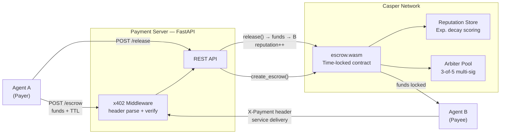

<a id="readme-top"></a>

<div align="center">

# AgentEscrow402

### HTTP 402 × Casper Network: autonomous escrow for AI-to-AI micropayments

*Agents pay agents. On-chain. No humans in the loop.*

[](https://github.com/alexbelij/AgentEscrow402/actions/workflows/ci.yml)
[](https://python.org)
[](https://testnet.cspr.live)
[](LICENSE)
[](https://ae402.xyz)
[](https://dorahacks.io/)

**[🚀 Live Demo](https://ae402.xyz)** · **[📐 Architecture](#-architecture)** · **[📡 API Reference](#-api-reference)** · **[SDK Docs](docs/SDK.md)**

</div>

---

> [!IMPORTANT]
> **What this is:** A deployed Casper testnet escrow console for AI-agent payments: signed x402 payment intent, Casper deploys for escrow lifecycle calls, Neon-backed hosted records, IsolationForest risk scoring, ML-KEM metadata encryption, and VRF-assisted arbitration. Console live at [ae402.xyz](https://ae402.xyz); API live at [agentescrow402-api.onrender.com](https://agentescrow402-api.onrender.com).

<details>
<summary><kbd>Table of contents</kbd></summary>

- [What makes it unique](#-what-makes-it-unique)
- [How it works](#-how-it-works)
- [Quickstart](#-quickstart)
- [Architecture](#-architecture)
- [Screenshots](#-screenshots)
- [Smart contract](#-smart-contract)
- [API reference](#-api-reference)
- [SDK and integrations](#-sdk-and-integrations)
- [Tech stack](#-tech-stack)
- [Testing](#-testing)
- [Team](#-team)
- [License](#-license)

</details>

---

## ✨ What makes it unique

The [x402 protocol](https://www.x402.org/) defines machine-to-machine payments via HTTP 402 headers. Existing implementations assume Ethereum facilitators. AgentEscrow402 brings the pattern to Casper Network with live testnet escrow calls plus a hosted console that labels what is on-chain, what is Neon-backed API state, and what is demo-signer convenience for browsers.

| Feature | AgentEscrow402 | Coinbase x402 | Manual invoicing |
|---|---|---|---|
| **Trustless on-chain escrow** | ✅ Time-locked WASM contract | ❌ Facilitator holds funds | ❌ N/A |
| **Reputation tracking** | ✅ Exponential decay, per-agent | ❌ None | ❌ None |
| **Multi-sig dispute resolution** | ✅ 3-of-5 arbiter vote | ⚠️ Facilitator decides | ⚠️ Manual |
| **Zero human facilitation** | ✅ Fully agentic | ⚠️ Needs setup | ❌ Always human |
| **Casper Network native** | ✅ WASM contract | ❌ EVM only | — |

<div align="right"><a href="#readme-top">↑ back to top</a></div>

---

## ⚙️ How it works

Four steps. Fully autonomous.

1. **Agent A creates escrow** — locks funds in a time-locked Casper contract with a TTL and service hash
2. **Agent B verifies payment** — checks the x402 header against the on-chain escrow before serving work
3. **Agent A releases** — confirms delivery; funds transfer to Agent B; reputation score updates
4. **Timeout protection** — if Agent B never delivers, Agent A reclaims funds after TTL expires; no arbiter needed

```
Agent A                    Payment Server                 Casper Network
  │                            │                              │
  ├─ POST /escrow ────────────▶│                              │
  │  {receiver, amount, ttl}   │── create_escrow() ─────────▶│
  │                            │                              │ funds locked
  │◀── 201 {service_hash} ────┤                              │
  │                            │                              │
  ├─ GET /api/compute ────────▶│                              │
  │  X-Payment: x402-v1;...    │── verify header ───────────▶│
  │                            │◀─ ok ──────────────────────┤
  │◀── 200 result ────────────┤                              │
  │                            │                              │
  ├─ POST /release ───────────▶│── release() ───────────────▶│
  │  {service_hash}            │                              │ funds → Agent B
  │◀── 200 ───────────────────┤  reputation updated on-chain │
```

**x402 header format:** `X-Payment: x402-v1;<escrow_hash>;<amount>;<sender>;<timestamp>;<nonce>;<signature>`

Protected endpoints return `402 Payment Required` with machine-readable terms when the header is missing.

<div align="right"><a href="#readme-top">↑ back to top</a></div>

---

## 🚀 Quickstart

Under 5 minutes for local development. No Casper node needed — sandbox mode is default locally.

**Prerequisites:** Python 3.11+

```bash
git clone https://github.com/alexbelij/AgentEscrow402.git
cd AgentEscrow402
pip install -r requirements.txt
cp .env.example .env
python -m uvicorn server.app:app --host 0.0.0.0 --port 8000
```

**Verify:**
```bash
curl http://localhost:8000/health
# {"status":"ok","sandbox":true,"db":"disconnected",...}
```

### Create your first escrow

```bash
curl -X POST http://localhost:8000/escrow \
  -H "Content-Type: application/json" \
  -H "X-Payment: x402-v1;<service_hash>;5000000;<sender>;<timestamp>;<nonce>;<signature>" \
  -d '{"receiver":"agent-B","amount":5000000,"service_hash":"<64-hex>","ttl":300}'
# {"service_hash":"<64-hex>","status":"pending",...}
```

### Check status

```bash
curl http://localhost:8000/escrow/<service_hash>
# {"service_hash":"<64-hex>","status":"pending","amount":5000000,...}
```

### Release after delivery

```bash
curl -X POST http://localhost:8000/release \
  -H "Content-Type: application/json" \
  -H "X-Payment: x402-v1;<service_hash>;5000000;<sender>;<timestamp>;<nonce>;<signature>" \
  -d '{"service_hash":"<64-hex>"}'
# {"status":"released",...}
```

> **Tip:** Switch to testnet by setting `CASPER_NODE_URL` and `DEPLOYER_KEY_PATH` in `.env`.

<div align="right"><a href="#readme-top">↑ back to top</a></div>

---

## 🧱 Architecture



*The payment server mediates between agent SDKs and the Casper contract. In sandbox mode the Casper client is replaced by an in-memory store. In the hosted demo, API records are persisted in Neon while the console clearly labels the hosted demo signer versus production x402 signatures.*

Detailed diagrams → [docs/ARCHITECTURE.md](docs/ARCHITECTURE.md)

<div align="right"><a href="#readme-top">↑ back to top</a></div>

---

## 📸 Screenshots

| Homepage — HTTP 402 flow | Console — escrow table | Escrow detail — release flow |
|---|---|---|
|  |  |  |

> Live at [ae402.xyz](https://ae402.xyz) · [ae402.xyz/console/overview](https://ae402.xyz/console/overview)

<div align="right"><a href="#readme-top">↑ back to top</a></div>

---

## 📜 Smart contract

Deployed on Casper Testnet:

| Contract | Hash |
|---|---|
| Core Escrow | `dca7e926af8aac73fc1104e1bb9a52b0035a9196bef5de8336557ea34cec69d6` (package: `d3ca33d192dda5ece798db91811ec1259d2197ca0e8d3ea4de043b977d3c8eeb`) |
| Escrow Manager | `bfa8c02cb3ab0f9d7bf03335f324973675200a597162e1e5fa4cb5a77dff675d` |
| Insurance Pool | `e36b958dc3ec27f8af6ad7e81f56c5ff5d06ad1a102e155259b60b6ab9f51f61` |
| VRF Arbiter | `5d65bedf67aeb8dc41426787da6a59735206728ce04c668f2a493b7b53392f7f` |

| Entry point | Description |
|---|---|
| `create_escrow` | Lock funds with TTL and service hash |
| `release` | Confirm delivery → funds to receiver |
| `refund` | Reclaim after TTL expiry |
| `dispute` | Open a contested payment |
| `resolve` | 3-of-5 arbiter vote → auto-payout |
| `configure_fee` | Set insurance pool fee (basis points) |
| `emergency_freeze` | Pause all state changes |

Security status: latest changed code was reviewed through NVIDIA API and no concrete HIGH blockers were reported for the console/Neon patch. Full production hardening and legacy test-suite modernization are still tracked in [docs/KNOWN_LIMITATIONS.md](docs/KNOWN_LIMITATIONS.md).

<div align="right"><a href="#readme-top">↑ back to top</a></div>

---

## 📡 API reference

Base URL (production): `https://agentescrow402-api.onrender.com`

| Method | Path | Description |
|---|---|---|
| `GET` | `/health` | Server health + mode |
| `POST` | `/escrow` | Create escrow — lock funds |
| `POST` | `/release` | Release funds to receiver |
| `POST` | `/refund` | Refund sender after TTL |
| `POST` | `/dispute` | Open dispute (sender or receiver) |
| `POST` | `/resolve` | Arbiter vote (3-of-5) |
| `GET` | `/escrow/{hash}` | Look up escrow by service hash |
| `GET` | `/stats` | Console statistics and data-source label |
| `GET` | `/risk/dashboard` | IsolationForest risk dashboard |
| `GET` | `/risk/score/{agent}` | Agent risk score |
| `GET` | `/insurance/pool-stats` | Hosted insurance pool accounting |
| `POST` | `/vrf/elect` | VRF-assisted arbiter election |
| `GET` | `/reputation/{agent}` | Agent trust score |
| `POST` | `/compute-hash` | Derive service hash from params |

**402 response format:**
```json
{
  "error": "payment_required",
  "accepts": "x402-v1",
  "price": 1000000,
  "receiver": "account-hash-74c9..."
}
```

<div align="right"><a href="#readme-top">↑ back to top</a></div>

---

## 🔌 SDK and integrations

### Python SDK
The real, live deployment (`sandbox=false`) requires a genuine Ed25519-signed
`X-Payment` header on every request — `EscrowClient.generate(...)` handles
that for you, deriving your agent's identity from a fresh keypair:
```python
from sdk import EscrowClient

async with EscrowClient.generate("https://agentescrow402-api.onrender.com") as client:
    receiver = "ab" * 32  # counterparty's 64-hex Casper account hash / Ed25519 public key
    escrow = await client.create_escrow(receiver=receiver, amount=5_000_000, ttl=300)
    await client.release(escrow["service_hash"])
```
Running against your own local sandbox instance (`SANDBOX=true`) still works
with a plain string identity and no signing:
```python
client = EscrowClient("http://localhost:8000", sender="my-agent", sandbox=True)
```
See `examples/quickstart.py` (minimal) and `examples/escrow_agent.py` (full
autonomous buyer/seller lifecycle with a real dispute + AI arbitration call)
for runnable end-to-end examples. `escrow_agent.py` signs real Ed25519
arbiter votes and resolves the dispute on-chain out of the box, using the
throwaway, never-funded testnet keypairs committed under
`demo/test-arbiter-keys/` (see that folder's README for why it's safe to
ship these particular private keys) — clone and run it, no credentials
needed, to watch create → dispute → resolve happen for real on Casper
Testnet.

### LangChain tool
```python
from sdk.langchain_tool import EscrowPaymentTool
tool = EscrowPaymentTool(base_url="http://localhost:8000", sender="my-agent")  # sandbox mode
result = await tool.run(action="create", receiver="ab" * 32, amount=1_000_000)
```

### MCP server (24 tools via stdio/SSE)
```bash
python sdk/mcp_server.py
```

Full SDK reference → [docs/SDK.md](docs/SDK.md)

<div align="right"><a href="#readme-top">↑ back to top</a></div>

---

## 🛠 Tech stack

| Layer | Technology |
|---|---|
| **Smart contract** | Rust → WASM, Casper 2.x CEP-88 |
| **Payment server** | Python 3.11, FastAPI, Uvicorn |
| **x402 middleware** | Custom header parser + validator |
| **Persistence** | Neon PostgreSQL-compatible serverless database for hosted API records |
| **Sandbox / testing** | In-memory fallback for local/demo development |
| **SDK** | Python async SDK, LangChain tool, MCP server |
| **CI** | GitHub Actions — lint → pytest → WASM build → cargo test |
| **Frontend** | React + Vite console, Vercel |
| **Backend hosting** | Render (always-on) |

<div align="right"><a href="#readme-top">↑ back to top</a></div>

---

## 🧪 Testing

Current validation status for the hosted demo branch:

```bash
python -m compileall -q server
npm --prefix frontend run build
ALLOW_HOSTED_DEMO_IDENTITY=true uv run python tests/test_business_logic.py
```

The custom business-logic runner is green, live smoke checks cover health/stats/escrow create+release/risk/VRF/insurance, and NVIDIA API security review reported no concrete HIGH blockers for the latest console/Neon patch. The legacy full pytest suite is not currently green because several tests still target older endpoint/model contracts; do not treat this repository as fully audited production code until that suite is modernized.

<div align="right"><a href="#readme-top">↑ back to top</a></div>

---

## 📝 License

[MIT](LICENSE)

**Security:** testnet keys only — never commit real deployer keys. See [docs/KNOWN_LIMITATIONS.md](docs/KNOWN_LIMITATIONS.md) for full risk assessment.

---

<div align="center">

Built for **[Casper Agentic Buildathon 2026](https://dorahacks.io/)** · Deployed on **[Casper Testnet](https://testnet.cspr.live/)**

*[ae402.xyz](https://ae402.xyz) · [API Docs](docs/SDK.md) · [Architecture](docs/ARCHITECTURE.md)*

</div>

[back-to-top]: https://img.shields.io/badge/-BACK_TO_TOP-151515?style=flat-square
