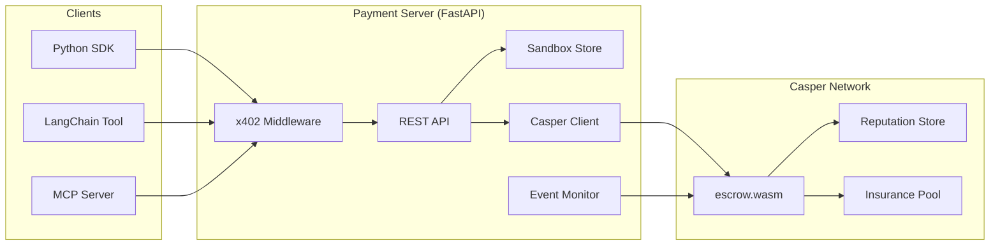

<a id="readme-top"></a>

<div align="center">

# AgentEscrow402

**x402 payment middleware for autonomous AI agents on Casper Network**

*Agents pay agents. No humans in the loop.*

[](https://github.com/alexbelij/AgentEscrow402/actions/workflows/ci.yml)
[](https://python.org)
[](https://casper.network)
[](LICENSE)

[Landing Page](https://alexbelij.github.io/AgentEscrow402/) · [Architecture](#-architecture) · [SDK Docs](docs/SDK.md)

</div>

---

> [!IMPORTANT]
> **What this is:** a deployed escrow system on Casper testnet where AI agents lock funds via HTTP 402 headers, deliver compute, and release payment — all without a human facilitator. The contract is live and verified.

<details>
<summary><kbd>Table of contents</kbd></summary>

- [What's new here](#-whats-new-here)
- [How it works](#-how-it-works)
- [Quickstart](#-quickstart)
- [Architecture](#-architecture)
- [Smart contract](#-smart-contract)
- [SDK and integrations](#-sdk-and-integrations)
- [API reference](#-api-reference)
- [Testing](#-testing)
- [Built today vs Roadmap](#-built-today-vs--roadmap)
- [Comparison](#-comparison)
- [Project structure](#-project-structure)
- [Team](#-team)
- [License](#-license)

</details>

## ✨ What's new here

The [x402 protocol](https://www.x402.org/) defines how machines pay for API calls using HTTP 402 headers. Current implementations assume Ethereum-based facilitators. AgentEscrow402 brings this to Casper Network with three additions that don't exist elsewhere:

1. **On-chain escrow with TTL** — funds sit in a time-locked contract, not a hot wallet. If the service isn't delivered, the sender reclaims after timeout.
2. **Reputation-weighted trust** — every completed transaction updates an on-chain trust score with exponential decay (`new = old × 0.95 + latest`). Agents can check counterparty reliability before committing funds.
3. **Multi-sig dispute resolution** — contested payments go to a 3-of-5 arbiter vote instead of a single facilitator.

No existing x402 implementation on any chain combines escrow + reputation + arbitration in one contract.

<div align="right">

[![][back-to-top]](#readme-top)

</div>

## ⚙️ How it works

```
Agent A                    Payment Server                 Casper Network
  │                            │                              │
  ├─ POST /escrow ────────────▶│                              │
  │  {receiver, amount, ttl}   │── create_escrow() ─────────▶│
  │                            │                              │ funds locked
  │◀── 201 {service_hash} ────┤                              │
  │                            │                              │
  ├─ GET /api/compute ────────▶│                              │
  │  X-Payment: x402-v1;...    │── verify header ───────────▶│
  │                            │◀─ ok ──────────────────────┤
  │◀── 200 result ────────────┤                              │
  │                            │                              │
  ├─ POST /release ───────────▶│── release() ───────────────▶│
  │  {service_hash}            │                              │ funds → Agent B
  │◀── 200 ───────────────────┤  reputation updated          │
```

The x402 header format: `X-Payment: x402-v1;<escrow_hash>;<amount>;<sender>;<signature>`

Protected endpoints return `402 Payment Required` when the header is missing, with machine-readable payment terms.

<div align="right">

[![][back-to-top]](#readme-top)

</div>

## 🚀 Quickstart

Runs in under 5 minutes. No Casper node needed — sandbox mode is the default.

**Prerequisites:** Python 3.11+, pip

```bash
git clone https://github.com/alexbelij/AgentEscrow402.git
cd AgentEscrow402
pip install -r requirements.txt
cp .env.example .env
python -m uvicorn server.app:app --host 0.0.0.0 --port 8000
```

**Expected output:**
```
INFO:     Uvicorn running on http://0.0.0.0:8000
INFO:     Application startup complete.
```

**Verify it works:**
```bash
curl http://localhost:8000/health
# {"status":"ok","mode":"sandbox"}
```

### Docker alternative

```bash
docker-compose up
# Server at http://localhost:8000 in sandbox mode
```

### First escrow (Python)

```python
from sdk.client import EscrowClient

async with EscrowClient("http://localhost:8000", sender="agent-A") as client:
    escrow = await client.create_escrow(
        receiver="agent-B",
        amount=5_000_000,   # 5 CSPR in motes
        ttl=300,            # 5 min timeout
    )
    print(escrow["service_hash"])

    # after service delivery:
    await client.release(escrow["service_hash"])
```

> [!TIP]
> Sandbox mode stores everything in memory — no blockchain calls, no keys required. Switch to testnet by setting `CASPER_NODE_URL` and `DEPLOYER_KEY_PATH` in `.env`.

<div align="right">

[![][back-to-top]](#readme-top)

</div>

## 🧱 Architecture



*The payment server sits between agent SDKs and the Casper contract. The middleware validates x402 headers on every request. In sandbox mode, the Casper Client is replaced by an in-memory store with identical behavior.*

Detailed diagrams: [docs/ARCHITECTURE.md](docs/ARCHITECTURE.md)

<div align="right">

[![][back-to-top]](#readme-top)

</div>

## 📜 Smart contract

Deployed on Casper testnet. Contract hash: [`5dd33e8e...`](https://testnet.cspr.live/contract/5dd33e8e79789d386832a80c39006002383fa44dd76ba677cae3279f3a134451)

| Entry point | Description |
|---|---|
| `create_escrow` | Lock funds with TTL and service hash |
| `release` | Sender confirms delivery → funds go to receiver |
| `refund` | Reclaim funds after TTL expiry |
| `dispute` | Sender or receiver opens a dispute |
| `resolve` | 3-of-5 arbiters vote to release or refund |
| `configure_fee` | Set insurance pool fee (basis points) |
| `emergency_freeze` | Pause all state changes (admin) |

**Compile from source:**

```bash
cd contracts/escrow
cargo build --release --target wasm32-unknown-unknown --no-default-features
# -> target/wasm32-unknown-unknown/release/escrow.wasm (168K)
```

Security audit: 18 findings identified and fixed. Risk score reduced from 6/10 to 2/10. Full report in [docs/KNOWN_LIMITATIONS.md](docs/KNOWN_LIMITATIONS.md).

<div align="right">

[![][back-to-top]](#readme-top)

</div>

## 🔌 SDK and integrations

### Python SDK

```python
from sdk import EscrowClient

client = EscrowClient(base_url="http://localhost:8000", sender="my-agent")
```

Full reference: [docs/SDK.md](docs/SDK.md)

### LangChain tool

```python
from sdk.langchain_tool import EscrowPaymentTool

tool = EscrowPaymentTool(base_url="http://localhost:8000", sender="my-agent")
result = await tool.run(action="create", receiver="target", amount=1_000_000)
```

### MCP server

```bash
python sdk/mcp_server.py
# Exposes 7 tools via stdio or SSE transport
```

<div align="right">

[![][back-to-top]](#readme-top)

</div>

## 📡 API reference

| Method | Path | Description |
|---|---|---|
| `GET` | `/health` | Server health and mode |
| `POST` | `/escrow` | Create new escrow |
| `POST` | `/release` | Release funds to receiver |
| `POST` | `/refund` | Refund to sender |
| `POST` | `/dispute` | Open dispute (sender or receiver only) |
| `POST` | `/resolve` | Arbiter vote (3-of-5) |
| `GET` | `/escrow/{hash}` | Look up escrow by service hash |
| `GET` | `/reputation/{agent}` | Agent trust score |
| `POST` | `/compute-hash` | Compute service hash from params |

**402 response example:**

```json
{
  "error": "payment_required",
  "accepts": "x402-v1",
  "price": 1000000,
  "receiver": "account-hash-74c9..."
}
```

<div align="right">

[![][back-to-top]](#readme-top)

</div>

## 🧪 Testing

103 tests total, all passing.

```bash
# Python tests (85)
PYTHONPATH=. pytest tests/ -v --tb=short

# Rust contract tests (18)
cd contracts/tests && cargo test --release
```

| Suite | Count | What it covers |
|---|---|---|
| `test_api.py` | 15 | All REST endpoints, error cases |
| `test_middleware.py` | 14 | x402 header parsing, validation |
| `test_models.py` | 15 | Pydantic schema validation |
| `test_sandbox.py` | 19 | Sandbox store CRUD, TTL, disputes |
| `test_casper_client.py` | 9 | RPC client mocks |
| `integration_tests.rs` | 18 | Contract entry point logic |

CI runs on every push: lint (ruff + black) → pytest → WASM build → cargo test.

<div align="right">

[![][back-to-top]](#readme-top)

</div>

## ✅ Built today vs 🗺 Roadmap

| Feature | Status | Evidence |
|---|---|---|
| Escrow contract (create/release/refund/dispute/resolve) | ✅ Live | [Testnet deploy](https://testnet.cspr.live/deploy/16e3787ca7307ea997a1a8b15d758f3ac1c8b4a105121dac26a2633033ef62ba) |
| x402 middleware + REST API | ✅ Live | 85 passing tests |
| Reputation system (exponential decay) | ✅ Live | Contract entry point |
| Emergency freeze | ✅ Live | Audit-verified |
| Insurance pool (2% fee) | ✅ Live | `configure_fee` entry point |
| Python SDK + LangChain tool | ✅ Live | `sdk/` directory |
| MCP server (7 tools) | ✅ Live | `sdk/mcp_server.py` |
| Sandbox mode | ✅ Live | Default startup mode |
| Multi-chain support | 🗺 Planned | — |
| Mainnet deployment | 🗺 Planned | Pending audit |
| Agent discovery registry | 🗺 Planned | — |

<div align="right">

[![][back-to-top]](#readme-top)

</div>

## ⚖️ Comparison

| | AgentEscrow402 | Coinbase x402 | Manual invoicing |
|---|---|---|---|
| Trustless escrow | ✅ On-chain, time-locked | ❌ Facilitator holds funds | ❌ N/A |
| Reputation tracking | ✅ On-chain, per-agent | ❌ None | ❌ None |
| Dispute resolution | ✅ 3-of-5 arbiter vote | ⚠️ Facilitator decides | ⚠️ Manual |
| Agent-native (no human) | ✅ Full automation | ⚠️ Needs facilitator setup | ❌ Human required |
| Casper Network | ✅ Native | ❌ EVM only | — |
| *Where they're better* | — | ✅ Production-tested, wide adoption | ✅ No crypto dependency |

<div align="right">

[![][back-to-top]](#readme-top)

</div>

## 📁 Project structure

```
AgentEscrow402/
├── contracts/escrow/        # Casper smart contract (Rust/WASM)
├── server/                  # FastAPI payment server
│   ├── app.py               # Routes and lifecycle
│   ├── middleware.py         # x402 header parsing
│   ├── sandbox.py           # In-memory escrow store
│   ├── casper_client.py     # Casper RPC wrapper
│   ├── event_monitor.py     # CEP-88 event listener
│   ├── models.py            # Pydantic models
│   └── config.py            # Environment config
├── sdk/                     # Python SDK + LangChain + MCP
├── tests/                   # 85 Python + 18 Rust tests
├── docs/                    # Architecture, SDK, known limitations
├── landing/                 # Project landing page
├── .github/workflows/       # CI pipeline
└── docker-compose.yml
```

## 👤 Team

**alexbelij** — protocol design, contracts, server ([GitHub](https://github.com/alexbelij))

Questions: [open an issue](https://github.com/alexbelij/AgentEscrow402/issues)

---

## 📝 License

[MIT](LICENSE) — see LICENSE for full text.

**Security:** testnet keys only. Never commit real deployer keys. See [docs/KNOWN_LIMITATIONS.md](docs/KNOWN_LIMITATIONS.md) for a full risk assessment.

*Last verified against commit `0db76e9`, 2026-06-29.*

[back-to-top]: https://img.shields.io/badge/-BACK_TO_TOP-151515?style=flat-square
