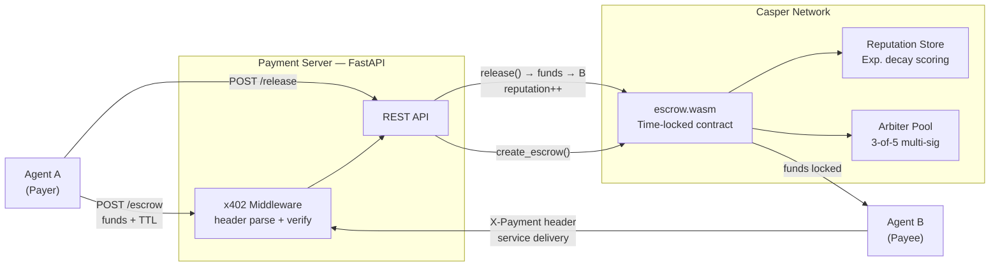

<a id="readme-top"></a>

<div align="center">

# AgentEscrow402

## HTTP 402 × Casper Network: autonomous escrow for AI-to-AI micropayments

*Agents pay agents. On-chain. No humans in the loop.*

[](https://github.com/alexbelij/AgentEscrow402/actions/workflows/ci.yml)
[](https://python.org)
[](https://testnet.cspr.live)
[](LICENSE)
[](https://ae402.xyz)
[](https://dorahacks.io/)

**[🚀 Live Demo](https://ae402.xyz)** · **[📐 Architecture](#-architecture)** · **[📡 API Reference](#-api-reference)** · **[SDK Docs](docs/SDK.md)**

</div>

---

> [!IMPORTANT]
> **What this is:** A deployed Casper testnet escrow console for AI-agent payments: signed x402 payment intent, Casper deploys for escrow lifecycle calls, Neon-backed hosted records, IsolationForest risk scoring, ML-KEM metadata encryption, and VRF-assisted arbitration. Console live at [ae402.xyz](https://ae402.xyz); API live at [agentescrow402-api.onrender.com](https://agentescrow402-api.onrender.com).

<details>
<summary><kbd>Table of contents</kbd></summary>

- [What makes it unique](#-what-makes-it-unique)
- [How it works](#-how-it-works)
- [Quickstart](#-quickstart)
- [Architecture](#-architecture)
- [Screenshots](#-screenshots)
- [What is real vs. simulated](#-what-is-real-vs-simulated)
- [Use cases](#-use-cases)
- [Smart contract](#-smart-contract)
- [API reference](#-api-reference)
- [SDK and integrations](#-sdk-and-integrations)
- [Tech stack](#-tech-stack)
- [Testing](#-testing)
- [All documentation](#-all-documentation)
- [License](#-license)

</details>

---

## ✨ What makes it unique

The [x402 protocol](https://www.x402.org/) defines machine-to-machine payments via HTTP 402 headers. Existing implementations assume Ethereum facilitators. AgentEscrow402 brings the pattern to Casper Network with live testnet escrow calls plus a hosted console that labels what is on-chain, what is Neon-backed API state, and what is demo-signer convenience for browsers.

| Feature | AgentEscrow402 | Coinbase x402 | Manual invoicing |
|---|---|---|---|
| **Trustless on-chain escrow** | ✅ Time-locked WASM contract | ❌ Facilitator holds funds | ❌ N/A |
| **Reputation tracking** | ✅ Exponential decay, per-agent | ❌ None | ❌ None |
| **Multi-sig dispute resolution** | ✅ 3-of-5 arbiter vote | ⚠️ Facilitator decides | ⚠️ Manual |
| **Zero human facilitation** | ✅ Fully agentic | ⚠️ Needs setup | ❌ Always human |
| **Casper Network native** | ✅ WASM contract | ❌ EVM only | — |
| **Multi-asset escrow** | ✅ CSPR, CEP-18, CEP-78 (real on-chain) | ❌ Single asset | — |
| **Atomic secret-for-payment swap** | ✅ SHA-256 HTLC commit/reveal | ❌ Not supported | — |
| **AI-assisted dispute triage** | ✅ Evidence scoring feeds the arbiter vote | ❌ None | ❌ None |
| **Sybil-resistant agent identity** | ✅ DID registry, staking + slashing | ❌ None | — |
| **Post-quantum metadata confidentiality** | ✅ ML-KEM-768 hybrid encryption | ❌ None | — |

See [what's real vs. simulated](#-what-is-real-vs-simulated) for exactly which of these are live
on-chain today versus API-level.

<div align="right"><a href="#readme-top">↑ back to top</a></div>

---

## ⚙️ How it works

Four steps, no human signature required mid-flow (see [verified on-chain transactions](#-testing)
and [what's real vs. simulated](#-what-is-real-vs-simulated) for the exact scope of that claim).

1. **Agent A creates escrow** — locks funds in a time-locked Casper contract with a TTL and service hash
2. **Agent B verifies payment** — checks the x402 header against the on-chain escrow before serving work
3. **Agent A releases** — confirms delivery; funds transfer to Agent B; reputation score updates
4. **Timeout protection** — if Agent B never delivers, Agent A reclaims funds after TTL expires; no arbiter needed

```
Agent A                    Payment Server                 Casper Network
  │                            │                              │
  ├─ POST /escrow ────────────▶│                              │
  │  {receiver, amount, ttl}   │── create_escrow() ─────────▶│
  │                            │                              │ funds locked
  │◀── 201 {service_hash} ────┤                              │
  │                            │                              │
  ├─ GET /api/compute ────────▶│                              │
  │  X-Payment: x402-v1;...    │── verify header ───────────▶│
  │                            │◀─ ok ──────────────────────┤
  │◀── 200 result ────────────┤                              │
  │                            │                              │
  ├─ POST /release ───────────▶│── release() ───────────────▶│
  │  {service_hash}            │                              │ funds → Agent B
  │◀── 200 ───────────────────┤  reputation updated on-chain │
```

**x402 header format:** `X-Payment: x402-v1;<escrow_hash>;<amount>;<sender>;<timestamp>;<nonce>;<signature>`

Protected endpoints return `402 Payment Required` with machine-readable terms when the header is missing.

This is the base happy-path lifecycle. The dispute-resolution vote, HTLC atomic-swap
commit/reveal, and multi-asset (CEP-18/CEP-78) flows each have their own diagram in
[docs/ARCHITECTURE.md](docs/ARCHITECTURE.md) rather than being crammed into this one.

<div align="right"><a href="#readme-top">↑ back to top</a></div>

---

## 🚀 Quickstart

Under 5 minutes for local development. No Casper node needed — sandbox mode is default locally.

**Prerequisites:** Python 3.11+

```bash
git clone https://github.com/alexbelij/AgentEscrow402.git
cd AgentEscrow402
pip install -r requirements.txt
cp .env.example .env
python -m uvicorn server.app:app --host 0.0.0.0 --port 8000
```

**Verify:**
```bash
curl http://localhost:8000/health
# {"status":"ok","sandbox":true,"db":"disconnected",...}
```

### Create your first escrow

```bash
curl -X POST http://localhost:8000/escrow \
  -H "Content-Type: application/json" \
  -H "X-Payment: x402-v1;<service_hash>;5000000;<sender>;<timestamp>;<nonce>;<signature>" \
  -d '{"receiver":"agent-B","amount":5000000,"service_hash":"<64-hex>","ttl":300}'
# {"service_hash":"<64-hex>","status":"pending",...}
```

### Check status

```bash
curl http://localhost:8000/escrow/<service_hash>
# {"service_hash":"<64-hex>","status":"pending","amount":5000000,...}
```

### Release after delivery

```bash
curl -X POST http://localhost:8000/release \
  -H "Content-Type: application/json" \
  -H "X-Payment: x402-v1;<service_hash>;5000000;<sender>;<timestamp>;<nonce>;<signature>" \
  -d '{"service_hash":"<64-hex>"}'
# {"status":"released",...}
```

> **Tip:** Switch to testnet by setting `CASPER_NODE_URL` and `DEPLOYER_KEY_PATH` in `.env`.

<div align="right"><a href="#readme-top">↑ back to top</a></div>

---

## 🔍 What is real vs. simulated

Judging a hackathon project means separating "works in a demo" from "works on-chain." Here's the
honest breakdown, verified against the current deployment (contract package `d3ca33d1...c8eeb`,
version 8, updated 2026-07-05):

| Component | Status | Evidence |
|---|---|---|
| Escrow create / release / refund / dispute / resolve | ✅ **Real on-chain** | Real Casper testnet transactions in live mode (`SANDBOX=false`, what production runs); see [Verified on-chain](#-testing) |
| HTLC atomic-swap (`commit_swap` / `reveal_swap`) | ✅ **Real on-chain** | SHA-256 commit/reveal entry points, live round-trip with cross-account reveal |
| CEP-18 (fungible token) transfers | ✅ **Real on-chain** | Deployed test token AETUSD, transfer + balance read against live contract state |
| CEP-2612-inspired gasless permit (CEP-18) | ✅ **Real on-chain** | Custom `permit()`/`permit_nonce()` entry points added to a forked CEP-18 contract (Ed25519-signature-gated allowance, no session-wasm needed); live-verified: owner signs an off-chain message only, relayer submits `permit()`+`transfer_from()` and pays gas, real balance moves |
| CEP-78 (NFT) mint/transfer | ✅ **Real on-chain** | Deployed test collection AETNFT, mint + transfer + ownership read against live contract state |
| x402 signature verification | ✅ **Real crypto** | Ed25519 verify (`cryptography` lib) + nonce replay protection, not a stub |
| Reputation scoring, staking, slashing | ✅ **Real logic** | Exponential decay + stake-weighted slashing in `identity_registry_api.py` |
| Arbiter multisig resolution | ✅ **Real crypto** | Real Ed25519 3-of-5 quorum check over the escrow/verdict payload, replay-proof |
| Payment streaming (`/escrow/stream`) | ⚠️ **API-level simulation** | Streamed/remaining amount computed from wall-clock time in the backend; not an on-chain per-tick release yet |
| Hosted console demo-signer | ⚠️ **Explicit, labelled bypass** | One fixed public demo identity + signature, gated by `ALLOW_HOSTED_DEMO_IDENTITY`, so browser visitors without a wallet can try the console — never used in the signature-verification code path for real requests |
| TEE-attested proofs, on-chain ZK-KYC, cross-chain bridge | ❌ **Not implemented** | Roadmap ideas only — would need real TEE hardware or a ZK circuit; out of scope for the hackathon deadline, see [ROADMAP.md](ROADMAP.md) |

Full detail (including smart-contract-level caveats like the missing reentrancy guard) is in
[docs/KNOWN_LIMITATIONS.md](docs/KNOWN_LIMITATIONS.md) — kept current, not a one-time snapshot.

<div align="right"><a href="#readme-top">↑ back to top</a></div>

---

## 🧩 Use cases

Concrete scenarios this unlocks today, not hypotheticals:

1. **Autonomous data-provider agents** — an AI agent buys a single API call, dataset row, or model
   inference from another agent, pays through escrow, and the seller only gets funds once the
   buyer confirms receipt. No invoicing, no manual reconciliation, no trusted intermediary holding
   the money.
2. **Multi-agent pipelines with built-in recourse** — a chain of agents (scraper → summarizer →
   translator) each escrow-pay the next step; if any step fails to deliver, the TTL-based refund
   or the 3-of-5 arbiter dispute path returns funds automatically instead of the payer eating the
   loss.
3. **Reputation-gated marketplaces** — buyers can filter sellers by on-chain reputation score
   (exponential decay + slashing) before ever escrowing funds, so bad actors lose standing
   automatically rather than needing a human moderator.
4. **Cross-asset agent payments** — an agent can be paid in native CSPR, a fungible token
   (CEP-18), or even receive an NFT (CEP-78) as proof-of-service, all through the same escrow
   lifecycle and the same x402 header.
5. **Atomic secret-for-payment swaps** — the HTLC `commit_swap`/`reveal_swap` flow lets a seller
   release a secret (an API key, a decryption key, a proof) *only* in the same transaction that
   pays them — either both happen or neither does.

<div align="right"><a href="#readme-top">↑ back to top</a></div>

---

## 🧱 Architecture



*The payment server mediates between agent SDKs and the Casper contract. In sandbox mode the Casper client is replaced by an in-memory store. In the hosted demo, API records are persisted in Neon while the console clearly labels the hosted demo signer versus production x402 signatures.*

Detailed diagrams → [docs/ARCHITECTURE.md](docs/ARCHITECTURE.md)

<div align="right"><a href="#readme-top">↑ back to top</a></div>

---

## 📸 Screenshots

Real screenshots of the live deployment (captured 2026-07-05, not mockups):

| Homepage | Console overview |
|---|---|
|  |  |

| Escrows table | Escrow detail | Arbitration (AI dispute analysis) |
|---|---|---|
|  |  |  |

> Live at [ae402.xyz](https://ae402.xyz) · [ae402.xyz/console/overview](https://ae402.xyz/console/overview)

<div align="right"><a href="#readme-top">↑ back to top</a></div>

---

## 📜 Smart contract

Deployed on Casper Testnet:

| Contract | Hash | Explorer |
|---|---|---|
| Core Escrow | `612cead2226329fafec492042fd96a999df06d1e88c476913a167f44d3ddd9ec` (package: `d3ca33d192dda5ece798db91811ec1259d2197ca0e8d3ea4de043b977d3c8eeb`, v9) | [view](https://testnet.cspr.live/contract/612cead2226329fafec492042fd96a999df06d1e88c476913a167f44d3ddd9ec) |
| Escrow Manager | `bfa8c02cb3ab0f9d7bf03335f324973675200a597162e1e5fa4cb5a77dff675d` | [view](https://testnet.cspr.live/contract/bfa8c02cb3ab0f9d7bf03335f324973675200a597162e1e5fa4cb5a77dff675d) |
| Insurance Pool | `e128780fd7e41159df4ca14d8584c7ef0cea2d75e6d5ba4166d94ca41f2d8929` (A1-hardened redeploy — the old `e36b958d...` had a fully public `claim()`/`withdraw()`, superseded) | [view](https://testnet.cspr.live/contract/e128780fd7e41159df4ca14d8584c7ef0cea2d75e6d5ba4166d94ca41f2d8929) |
| VRF Arbiter | `78ae28702deeb2eadec573d95b870f68b928a82a3566e292ff33a9ae2c779c93` (package: `53805f7866cd158ff091ab93efe2f19bd2e803414a5ef1badc7a46d759f36611`) | [view](https://testnet.cspr.live/contract/78ae28702deeb2eadec573d95b870f68b928a82a3566e292ff33a9ae2c779c93) |
| CEP-18 test token (AETUSD) | `177ca5d88f72e1ca72fbe94a24ba34b03830dd1fe63d90d3d719cd6e6d4de754` | [view](https://testnet.cspr.live/contract/177ca5d88f72e1ca72fbe94a24ba34b03830dd1fe63d90d3d719cd6e6d4de754) |

| Entry point | Description |
|---|---|
| `create_escrow` | Lock funds with TTL and service hash |
| `release` | Confirm delivery → funds to receiver (arbiter-quorum-gated above the release cap) |
| `refund` | Reclaim after TTL expiry |
| `dispute` | Open a contested payment |
| `resolve` | 3-of-5 arbiter vote → auto-payout |
| `commit_swap` | HTLC atomic-swap: sender locks a SHA-256 hash of a secret |
| `reveal_swap` | HTLC atomic-swap: anyone who knows the secret releases funds |
| `configure_fee` | Set insurance pool fee (basis points) |
| `set_release_cap` | Update the amount above which an arbiter-quorum approval is required |
| `set_arbiters` | Rotate the 5-account arbiter pool (no redeploy needed) |
| `emergency_freeze` | Pause all state changes (installer-only) |
| `unfreeze` | Resume operations after `emergency_freeze` (installer-only) |

Security status: latest changed code was reviewed through NVIDIA API and no concrete HIGH blockers were reported for the console/Neon patch. Full production hardening and legacy test-suite modernization are still tracked in [docs/KNOWN_LIMITATIONS.md](docs/KNOWN_LIMITATIONS.md).

<div align="right"><a href="#readme-top">↑ back to top</a></div>

---

## 📡 API reference

Base URL (production): `https://agentescrow402-api.onrender.com`

| Method | Path | Description |
|---|---|---|
| `GET` | `/health` | Server health + mode |
| `POST` | `/escrow` | Create escrow — lock funds |
| `POST` | `/release` | Release funds to receiver |
| `POST` | `/refund` | Refund sender after TTL |
| `POST` | `/dispute` | Open dispute (sender or receiver) |
| `POST` | `/resolve` | Arbiter vote (3-of-5) |
| `GET` | `/escrow/{hash}` | Look up escrow by service hash |
| `GET` | `/stats` | Console statistics and data-source label |
| `GET` | `/risk/dashboard` | IsolationForest risk dashboard |
| `GET` | `/risk/score/{agent}` | Agent risk score |
| `GET` | `/insurance/pool-stats` | Hosted insurance pool accounting |
| `POST` | `/vrf/elect` | VRF-assisted arbiter election |
| `GET` | `/reputation/{agent}` | Agent trust score |
| `POST` | `/compute-hash` | Derive service hash from params |

**402 response format:**
```json
{
  "error": "payment_required",
  "accepts": "x402-v1",
  "price": 1000000,
  "receiver": "account-hash-74c9..."
}
```

<div align="right"><a href="#readme-top">↑ back to top</a></div>

---

## 🔌 SDK and integrations

### Python SDK
The real, live deployment (`sandbox=false`) requires a genuine Ed25519-signed
`X-Payment` header on every request — `EscrowClient.generate(...)` handles
that for you, deriving your agent's identity from a fresh keypair:
```python
from sdk import EscrowClient

async with EscrowClient.generate("https://agentescrow402-api.onrender.com") as client:
    receiver = "ab" * 32  # counterparty's 64-hex Casper account hash / Ed25519 public key
    escrow = await client.create_escrow(receiver=receiver, amount=5_000_000, ttl=300)
    await client.release(escrow["service_hash"])
```
Running against your own local sandbox instance (`SANDBOX=true`) still works
with a plain string identity and no signing:
```python
client = EscrowClient("http://localhost:8000", sender="my-agent", sandbox=True)
```
See `examples/quickstart.py` (minimal) and `examples/escrow_agent.py` (full
autonomous buyer/seller lifecycle with a real dispute + AI arbitration call)
for runnable end-to-end examples. `escrow_agent.py` signs real Ed25519
arbiter votes and resolves the dispute on-chain out of the box, using the
throwaway, never-funded testnet keypairs committed under
`demo/test-arbiter-keys/` (see that folder's README for why it's safe to
ship these particular private keys) — clone and run it, no credentials
needed, to watch create → dispute → resolve happen for real on Casper
Testnet.

### LangChain tool
```python
from sdk.langchain_tool import EscrowPaymentTool
tool = EscrowPaymentTool(base_url="http://localhost:8000", sender="my-agent")  # sandbox mode
result = await tool.run(action="create", receiver="ab" * 32, amount=1_000_000)
```

### MCP server (24 tools via stdio/SSE)
```bash
python sdk/mcp_server.py
```

Full SDK reference → [docs/SDK.md](docs/SDK.md) · Standalone JSON-Schema for all 24 tools (no
server needed to browse) → [docs/mcp_tools_schema.json](docs/mcp_tools_schema.json)

<div align="right"><a href="#readme-top">↑ back to top</a></div>

---

## 🛠 Tech stack

| Layer | Technology |
|---|---|
| **Smart contract** | Rust → WASM, Casper 2.x CEP-88 |
| **Payment server** | Python 3.11, FastAPI, Uvicorn |
| **x402 middleware** | Custom header parser + validator |
| **Persistence** | Neon PostgreSQL-compatible serverless database for hosted API records |
| **Sandbox / testing** | In-memory fallback for local/demo development |
| **SDK** | Python async SDK, LangChain tool, MCP server |
| **CI** | GitHub Actions — lint → pytest → WASM build → cargo test |
| **Frontend** | React + Vite console, Vercel |
| **Backend hosting** | Render (always-on) |

<div align="right"><a href="#readme-top">↑ back to top</a></div>

---

## 🧪 Testing

```bash
python -m compileall -q server
npm --prefix frontend run build
uv run --active python -m pytest -q          # 376 tests (server logic, x402, identity, risk, multi-asset)
cargo test --manifest-path contracts/escrow/Cargo.toml   # 29 tests (escrow, HTLC, arbitration)
ALLOW_HOSTED_DEMO_IDENTITY=true uv run python tests/test_business_logic.py   # live smoke: health/stats/escrow create+release/risk/VRF/insurance
```

**Current status: 437/437 Python + 40/40 Rust tests passing** (incl. Hypothesis/proptest
property-based invariant tests added for fee/insurance/TTL/quorum/reputation logic). (One test,
`test_delegate_expired_timestamp_rejected`, has an occasional cross-module flake tied to
in-memory identity-registry state sharing between test files — not a production code bug, tracked
in [docs/KNOWN_LIMITATIONS.md](docs/KNOWN_LIMITATIONS.md).) NVIDIA API-assisted security review
reported no concrete HIGH blockers for the latest console/Neon/contract patch.

### Verified on-chain (this is not simulated — real testnet transactions)

| Flow | Deploy/tx hash | Result |
|---|---|---|
| Escrow create (CSPR) | `a3c5da80...f6f40a8ad` | ✅ processed |
| `release()` on the current (v8, fixed) contract | `0184cc2b...06c3ee53` | ✅ processed, no error |
| HTLC atomic-swap upgrade deploy | `2211685a...29c7aaa2` | ✅ processed |
| HTLC `commit_swap` → `reveal_swap`, revealed by a *different* account than the committer | live round-trip on testnet, same session | ✅ funds transferred (2.94 CSPR), cross-account reveal confirmed |
| CEP-18 token transfer (AETUSD) | `2139b49e...07a82c387` | ✅ balance confirmed via `state_get_dictionary_item` |
| CEP-78 NFT mint (AETNFT) | `3a298259...f39d441` | ✅ ownership confirmed via `token_owners` dict |
| CEP-78 NFT transfer (AETNFT) | `c4046eaa...d599bc9d` | ✅ ownership confirmed via `token_owners` dict |

All hashes are independently verifiable on [testnet.cspr.live](https://testnet.cspr.live) or via
`https://api.testnet.cspr.cloud/deploys/{hash}`.

**Bulk on-chain volume:** beyond the curated flows above, **349/349** additional deploys were
submitted and confirmed on testnet with **zero failures** (same escrow contract as above) —
not just `create_escrow` spam, but the full escrow lifecycle: 173 `create_escrow`, 166
`release`, 4 sender-initiated `refund`, and 3 full `dispute` → 3-of-5 arbiter-multisig
`resolve` cycles (signed live with the same `demo/test-arbiter-keys/` used by
[`examples/escrow_agent.py`](examples/escrow_agent.py), confirming the arbiter set survived
the v8→v9 in-place contract upgrade). 20 of the 349 (10 `create`/`release` pairs) use the
10 pre-generated `agent_01`..`agent_10` accounts as the counterparty receiver, so the log
also demonstrates multi-agent-wallet participation, not just a single sender/receiver pair.
Full deploy-hash-by-deploy-hash log:
[docs/evidence/bulk_escrow_tx_log.jsonl](docs/evidence/bulk_escrow_tx_log.jsonl).

<div align="right"><a href="#readme-top">↑ back to top</a></div>

---

## 📚 All documentation

| Doc | What's in it |
|---|---|
| [docs/ARCHITECTURE.md](docs/ARCHITECTURE.md) | Detailed component/sequence diagrams |
| [docs/SDK.md](docs/SDK.md) | Python SDK, LangChain tool, MCP server (24 tools) reference |
| [docs/openapi.yaml](docs/openapi.yaml) | Full OpenAPI schema for the REST API |
| [docs/KNOWN_LIMITATIONS.md](docs/KNOWN_LIMITATIONS.md) | What's genuinely a gap vs. what's just intentional demo scope |
| [ROADMAP.md](ROADMAP.md) | Shipped vs. planned, phase by phase |
| [CHANGELOG.md](CHANGELOG.md) | Version history |
| [SUBMISSION.md](SUBMISSION.md) | Hackathon submission summary (links, track, checklist) |
| [CONTRIBUTING.md](CONTRIBUTING.md) | Dev setup, PR conventions |
| [SECURITY.md](SECURITY.md) | Vulnerability disclosure, key-handling policy |

## 📝 License

[MIT](LICENSE)

**Security:** testnet keys only — never commit real deployer keys. See [docs/KNOWN_LIMITATIONS.md](docs/KNOWN_LIMITATIONS.md) for full risk assessment.

---

<div align="center">

Built for **[Casper Agentic Buildathon 2026](https://dorahacks.io/)** · Deployed on **[Casper Testnet](https://testnet.cspr.live/)**

*[ae402.xyz](https://ae402.xyz) · [API Docs](docs/SDK.md) · [Architecture](docs/ARCHITECTURE.md)*

*Last verified against commit `4b125f1` / contract package `d3ca33d1...c8eeb` v9 (`612cead2...ddd9ec`), 2026-07-07.*

</div>

[back-to-top]: https://img.shields.io/badge/-BACK_TO_TOP-151515?style=flat-square
