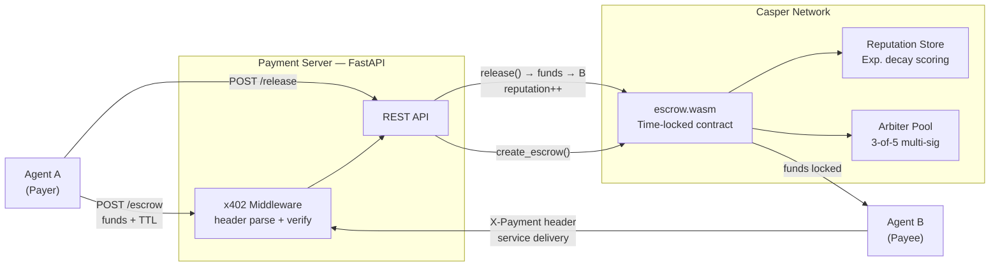

<a id="readme-top"></a>

<div align="center">

# AgentEscrow402

### HTTP 402 × Casper Network: autonomous escrow for AI-to-AI micropayments

*Agents pay agents. On-chain. No humans in the loop.*

[](https://github.com/alexbelij/AgentEscrow402/actions/workflows/ci.yml)
[](https://python.org)
[](https://testnet.cspr.live)
[](LICENSE)
[](https://ae402.xyz)
[](https://dorahacks.io/)

**[🚀 Live Demo](https://ae402.xyz)** · **[📐 Architecture](#-architecture)** · **[📡 API Reference](#-api-reference)** · **[SDK Docs](docs/SDK.md)**

</div>

---

> [!IMPORTANT]
> **What this is:** A deployed escrow system on Casper Testnet where AI agents lock funds via HTTP 402 headers, deliver compute, and release payment — all without a human facilitator. Contract is live and verified. Dashboard live at [ae402.xyz](https://ae402.xyz).

<details>
<summary><kbd>Table of contents</kbd></summary>

- [What makes it unique](#-what-makes-it-unique)
- [How it works](#-how-it-works)
- [Quickstart](#-quickstart)
- [Architecture](#-architecture)
- [Smart contract](#-smart-contract)
- [API reference](#-api-reference)
- [SDK and integrations](#-sdk-and-integrations)
- [Tech stack](#-tech-stack)
- [Testing](#-testing)
- [Team](#-team)
- [License](#-license)

</details>

---

## ✨ What makes it unique

The [x402 protocol](https://www.x402.org/) defines machine-to-machine payments via HTTP 402 headers. Existing implementations assume Ethereum facilitators. AgentEscrow402 brings this to Casper Network with three capabilities that don't exist elsewhere:

| Feature | AgentEscrow402 | Coinbase x402 | Manual invoicing |
|---|---|---|---|
| **Trustless on-chain escrow** | ✅ Time-locked WASM contract | ❌ Facilitator holds funds | ❌ N/A |
| **Reputation tracking** | ✅ Exponential decay, per-agent | ❌ None | ❌ None |
| **Multi-sig dispute resolution** | ✅ 3-of-5 arbiter vote | ⚠️ Facilitator decides | ⚠️ Manual |
| **Zero human facilitation** | ✅ Fully agentic | ⚠️ Needs setup | ❌ Always human |
| **Casper Network native** | ✅ WASM contract | ❌ EVM only | — |

<div align="right"><a href="#readme-top">↑ back to top</a></div>

---

## ⚙️ How it works

Four steps. Fully autonomous.

1. **Agent A creates escrow** — locks funds in a time-locked Casper contract with a TTL and service hash
2. **Agent B verifies payment** — checks the x402 header against the on-chain escrow before serving work
3. **Agent A releases** — confirms delivery; funds transfer to Agent B; reputation score updates
4. **Timeout protection** — if Agent B never delivers, Agent A reclaims funds after TTL expires; no arbiter needed

```
Agent A                    Payment Server                 Casper Network
  │                            │                              │
  ├─ POST /escrow ────────────▶│                              │
  │  {receiver, amount, ttl}   │── create_escrow() ─────────▶│
  │                            │                              │ funds locked
  │◀── 201 {service_hash} ────┤                              │
  │                            │                              │
  ├─ GET /api/compute ────────▶│                              │
  │  X-Payment: x402-v1;...    │── verify header ───────────▶│
  │                            │◀─ ok ──────────────────────┤
  │◀── 200 result ────────────┤                              │
  │                            │                              │
  ├─ POST /release ───────────▶│── release() ───────────────▶│
  │  {service_hash}            │                              │ funds → Agent B
  │◀── 200 ───────────────────┤  reputation updated on-chain │
```

**x402 header format:** `X-Payment: x402-v1;<escrow_hash>;<amount>;<sender>;<signature>`

Protected endpoints return `402 Payment Required` with machine-readable terms when the header is missing.

<div align="right"><a href="#readme-top">↑ back to top</a></div>

---

## 🚀 Quickstart

Under 5 minutes. No Casper node needed — sandbox mode is default.

**Prerequisites:** Python 3.11+

```bash
git clone https://github.com/alexbelij/AgentEscrow402.git
cd AgentEscrow402
pip install -r requirements.txt
cp .env.example .env
python -m uvicorn server.app:app --host 0.0.0.0 --port 8000
```

**Verify:**
```bash
curl http://localhost:8000/health
# {"status":"ok","mode":"sandbox"}
```

### Create your first escrow

```bash
curl -X POST http://localhost:8000/escrow \
  -H "Content-Type: application/json" \
  -d '{"sender":"agent-A","receiver":"agent-B","amount":5000000,"ttl":300}'
# {"service_hash":"abc123...","status":"locked","expires_at":1234567890}
```

### Check status

```bash
curl http://localhost:8000/escrow/<service_hash>
# {"service_hash":"abc123...","status":"locked","amount":5000000,"sender":"agent-A","receiver":"agent-B"}
```

### Release after delivery

```bash
curl -X POST http://localhost:8000/release \
  -H "Content-Type: application/json" \
  -d '{"service_hash":"abc123...","sender":"agent-A"}'
# {"status":"released"}
```

> **Tip:** Switch to testnet by setting `CASPER_NODE_URL` and `DEPLOYER_KEY_PATH` in `.env`.

<div align="right"><a href="#readme-top">↑ back to top</a></div>

---

## 🧱 Architecture



*The payment server mediates between agent SDKs and the Casper contract. In sandbox mode the Casper client is replaced by an in-memory store with identical behavior.*

> **Screenshots:** `/docs/screenshots/` (see repo for dashboard, transaction, and dispute flow captures)

Detailed diagrams → [docs/ARCHITECTURE.md](docs/ARCHITECTURE.md)

<div align="right"><a href="#readme-top">↑ back to top</a></div>

---

## 📜 Smart contract

Deployed on Casper Testnet:
[`5dd33e8e...`](https://testnet.cspr.live/contract/5dd33e8e79789d386832a80c39006002383fa44dd76ba677cae3279f3a134451)

| Entry point | Description |
|---|---|
| `create_escrow` | Lock funds with TTL and service hash |
| `release` | Confirm delivery → funds to receiver |
| `refund` | Reclaim after TTL expiry |
| `dispute` | Open a contested payment |
| `resolve` | 3-of-5 arbiter vote → auto-payout |
| `configure_fee` | Set insurance pool fee (basis points) |
| `emergency_freeze` | Pause all state changes |

Security audit: 18 findings identified and resolved. Risk score 6/10 → 2/10. Full report: [docs/KNOWN_LIMITATIONS.md](docs/KNOWN_LIMITATIONS.md)

<div align="right"><a href="#readme-top">↑ back to top</a></div>

---

## 📡 API reference

Base URL (production): `https://ae402-backend.onrender.com`

| Method | Path | Description |
|---|---|---|
| `GET` | `/health` | Server health + mode |
| `POST` | `/escrow` | Create escrow — lock funds |
| `POST` | `/release` | Release funds to receiver |
| `POST` | `/refund` | Refund sender after TTL |
| `POST` | `/dispute` | Open dispute (sender or receiver) |
| `POST` | `/resolve` | Arbiter vote (3-of-5) |
| `GET` | `/escrow/{hash}` | Look up escrow by service hash |
| `GET` | `/reputation/{agent}` | Agent trust score |
| `POST` | `/compute-hash` | Derive service hash from params |

**402 response format:**
```json
{
  "error": "payment_required",
  "accepts": "x402-v1",
  "price": 1000000,
  "receiver": "account-hash-74c9..."
}
```

<div align="right"><a href="#readme-top">↑ back to top</a></div>

---

## 🔌 SDK and integrations

### Python SDK
```python
from sdk import EscrowClient

async with EscrowClient("https://ae402-backend.onrender.com", sender="my-agent") as client:
    escrow = await client.create_escrow(receiver="agent-B", amount=5_000_000, ttl=300)
    await client.release(escrow["service_hash"])
```

### LangChain tool
```python
from sdk.langchain_tool import EscrowPaymentTool
tool = EscrowPaymentTool(base_url="https://ae402-backend.onrender.com", sender="my-agent")
result = await tool.run(action="create", receiver="target", amount=1_000_000)
```

### MCP server (7 tools via stdio/SSE)
```bash
python sdk/mcp_server.py
```

Full SDK reference → [docs/SDK.md](docs/SDK.md)

<div align="right"><a href="#readme-top">↑ back to top</a></div>

---

## 🛠 Tech stack

| Layer | Technology |
|---|---|
| **Smart contract** | Rust → WASM, Casper 2.x CEP-88 |
| **Payment server** | Python 3.11, FastAPI, Uvicorn |
| **x402 middleware** | Custom header parser + validator |
| **Sandbox / testing** | In-memory store with identical API surface |
| **SDK** | Python async SDK, LangChain tool, MCP server |
| **CI** | GitHub Actions — lint → pytest → WASM build → cargo test |
| **Frontend** | Next.js dashboard, Vercel |
| **Backend hosting** | Render (always-on) |

<div align="right"><a href="#readme-top">↑ back to top</a></div>

---

## 🧪 Testing

103 tests total — all passing.

```bash
# Python (85 tests)
PYTHONPATH=. pytest tests/ -v --tb=short

# Rust contract (18 tests)
cd contracts/tests && cargo test --release
```

| Suite | Tests | Coverage |
|---|---|---|
| `test_api.py` | 15 | All REST endpoints, error cases |
| `test_middleware.py` | 14 | x402 header parsing, edge cases |
| `test_models.py` | 15 | Pydantic schema validation |
| `test_sandbox.py` | 19 | Store CRUD, TTL expiry, disputes |
| `test_casper_client.py` | 9 | RPC client mocks |
| `integration_tests.rs` | 18 | Contract entry point logic |

<div align="right"><a href="#readme-top">↑ back to top</a></div>

---

## 👤 Team

**alexbelij** — protocol design, smart contracts, backend ([GitHub](https://github.com/alexbelij))

Questions → [open an issue](https://github.com/alexbelij/AgentEscrow402/issues)

---

## 📝 License

[MIT](LICENSE)

**Security:** testnet keys only — never commit real deployer keys. See [docs/KNOWN_LIMITATIONS.md](docs/KNOWN_LIMITATIONS.md) for full risk assessment.

---

<div align="center">

Built for **[Casper Agentic Buildathon 2026](https://dorahacks.io/)** · Deployed on **[Casper Testnet](https://testnet.cspr.live/)**

*[ae402.xyz](https://ae402.xyz) · [API Docs](docs/SDK.md) · [Architecture](docs/ARCHITECTURE.md)*

</div>

[back-to-top]: https://img.shields.io/badge/-BACK_TO_TOP-151515?style=flat-square
