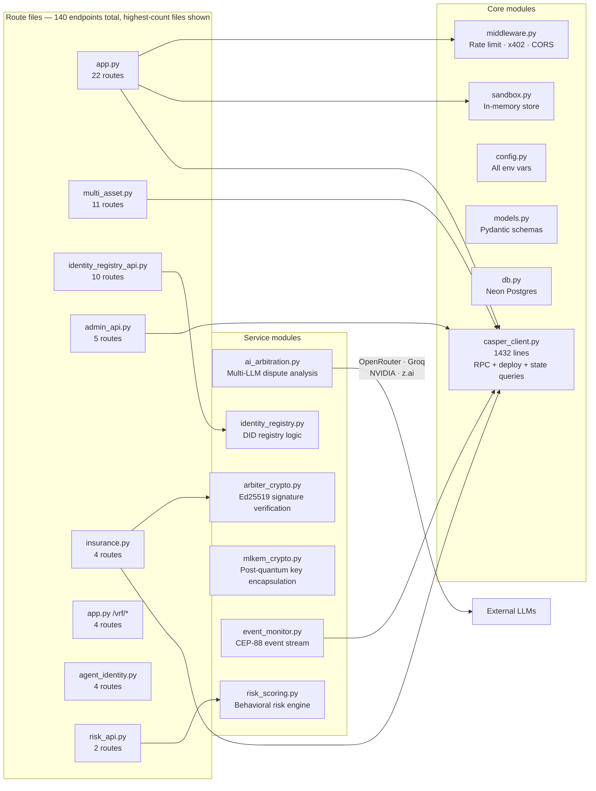
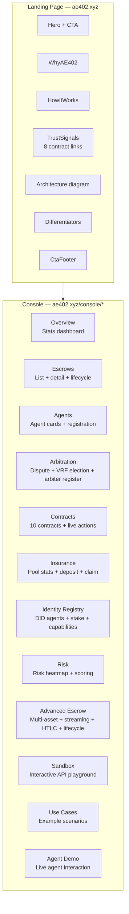
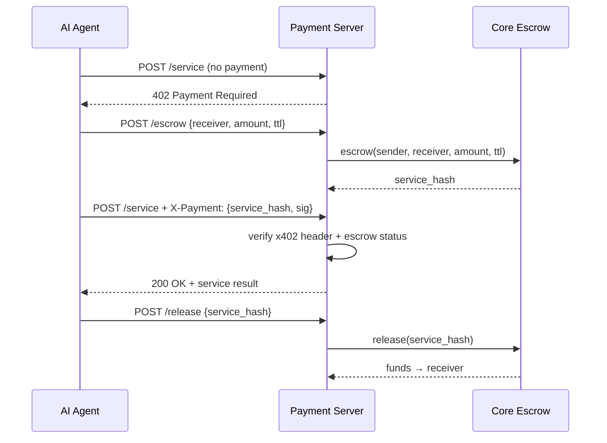
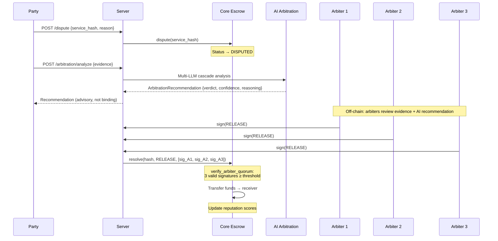
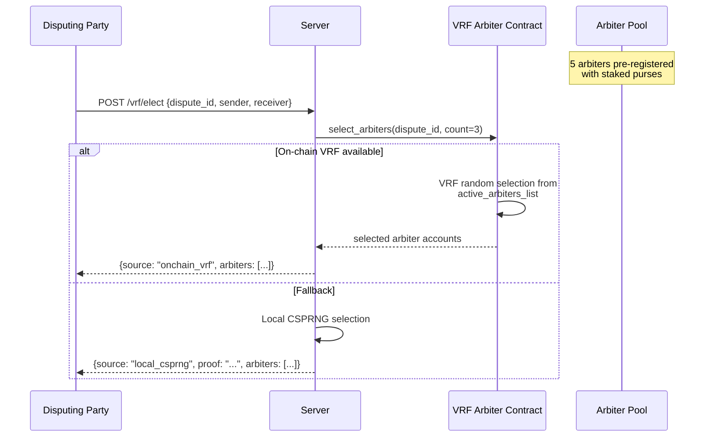
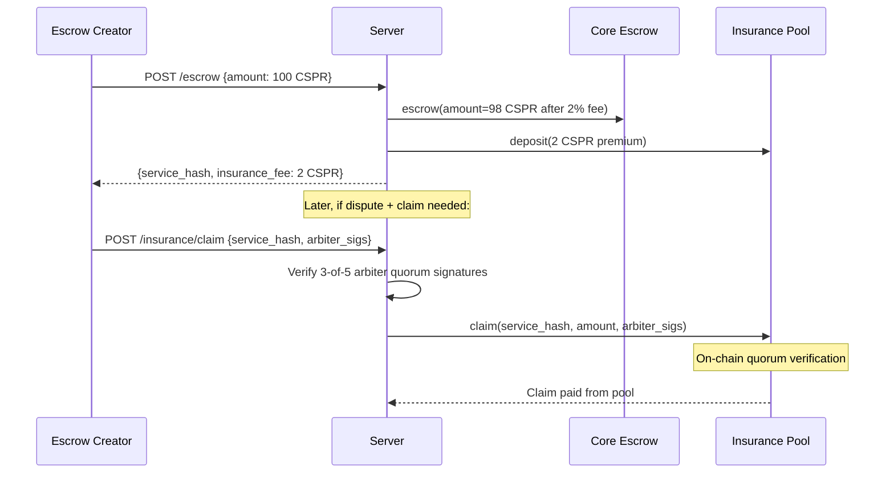
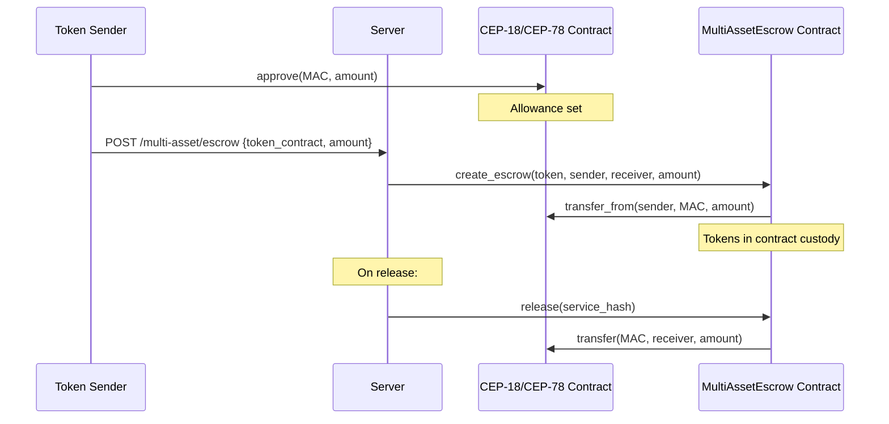
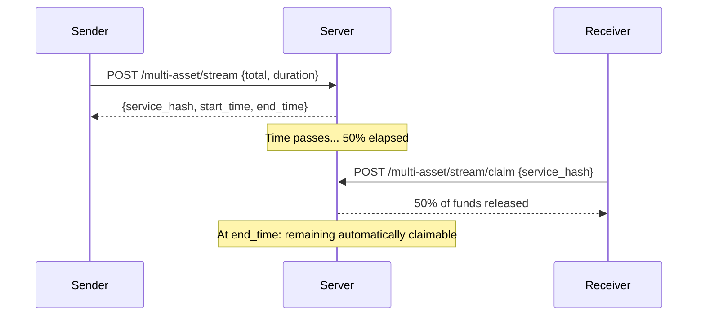
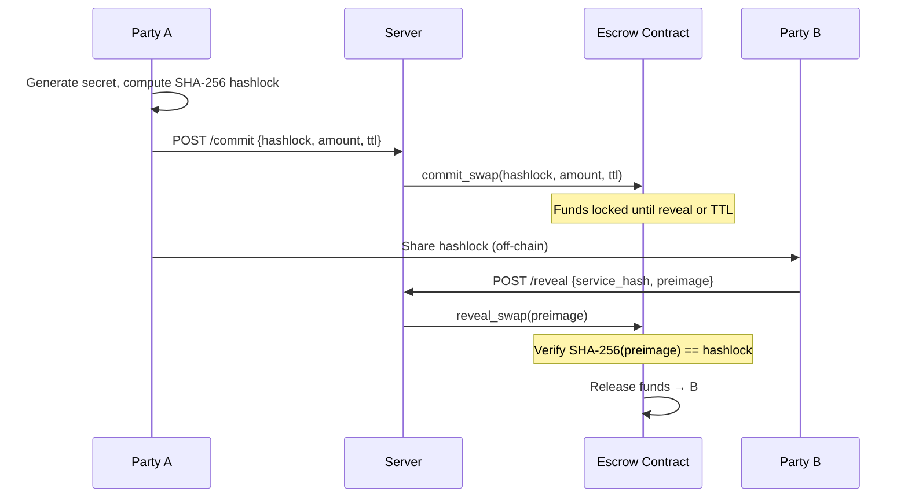
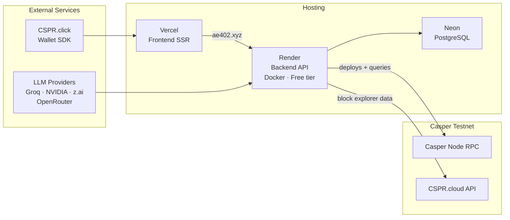

# Architecture

## System Overview

AE402 is a full-stack payment infrastructure for autonomous AI agents on the Casper blockchain.
The system comprises **9 smart contracts live on testnet (13 total in `main`, 4 code-complete pending deploy)**, a **FastAPI backend** (140 endpoints — see `GET /openapi.json` for the exact, always-current count), a **React
frontend** (12 console pages), a **Python SDK** with **LangChain** and **MCP** (26 tools)
integrations, and on-chain evidence of 369+ real testnet transactions.

```mermaid
graph TB
    subgraph Clients
        AI[AI Agent / LLM]
        UI[React Console]
        SDK_C[Python SDK]
        MCP[MCP Server<br/>26 tools]
        LC[LangChain Tool]
    end

    AI -->|x402 header| API
    UI -->|REST + WebSocket| API
    SDK_C --> API
    MCP --> SDK_C
    LC --> SDK_C

    subgraph Backend [FastAPI Backend — 140 endpoints]
        API[app.py<br/>Core routes]
        MA[multi_asset.py<br/>CEP-18/CEP-78/streaming/HTLC]
        INS[insurance.py<br/>Pool & claims]
        IDR[identity_registry_api.py<br/>DID registry]
        ARB[ai_arbitration.py<br/>AI dispute analysis]
        VRF_S[app.py /vrf/*<br/>Arbiter election]
        ADM[admin_api.py<br/>Admin & freeze]
        RISK[risk_api.py<br/>Risk scoring]
        MW[middleware.py<br/>Rate limit · x402 · CORS]
        DB[(Neon Postgres)]
        SB[sandbox.py<br/>In-memory mode]
    end

    API --> MW
    API --> DB
    API --> SB

    subgraph Casper [Casper Testnet — 10 contracts live (13 total)]
        ESC[Core Escrow<br/>14 entry points]
        MGR[Escrow Manager<br/>5 entry points]
        INSC[Insurance Pool<br/>7 entry points]
        VRFC[VRF Arbiter<br/>8 entry points]
        IDC[Identity Registry<br/>9 entry points]
        MAC[MultiAssetEscrow<br/>10 entry points]
        TOK[AEMAT<br/>CEP-18 token]
        NFT[AETNFT<br/>CEP-78 NFT]
    end

    API -->|create/release/refund<br/>dispute/resolve| ESC
    API -->|batch ops| MGR
    INS -->|deposit/claim/withdraw| INSC
    VRF_S -->|register/select/vote| VRFC
    IDR -->|register/stake/slash| IDC
    MA -->|multi-asset escrow| MAC
    MA -->|token transfers| TOK
    MA -->|NFT transfers| NFT

    subgraph Session [Session WASMs]
        EF[escrow_funder.wasm]
        BF[batch_funder.wasm]
        PF[pool_funder.wasm]
        IF[id_registry_funder.wasm]
        AR[arbiter_registrar.wasm]
    end

    UI -->|CSPR.click wallet| EF
    API --> BF
    API --> PF
    API --> IF
    API --> AR

    EM[Event Monitor] -->|CEP-88 SSE| ESC
    EM -->|status updates| API
```

---

## Smart Contracts (Rust, `contracts/`)

All contracts are written in Rust targeting the Casper VM (CEP-88 events). Each is deployed as a
versioned stored contract (`new_contract()` with `entry_points` + `named_keys`).

### Core Escrow (`contracts/escrow/`)
The primary contract. Manages the full escrow lifecycle.

| Entry point | Description |
|---|---|
| `escrow()` | Create a new escrow with sender, receiver, amount, TTL; deducts insurance fee |
| `release()` | Sender releases funds to receiver; requires `status == pending` |
| `refund()` | Refund expired escrow to sender; requires `status == pending` and TTL passed |
| `dispute()` | Either party raises a dispute; transitions to `disputed` |
| `resolve()` | 3-of-5 arbiter multi-sig verdict (RELEASE or REFUND); verifies quorum signatures |
| `commit_swap()` | HTLC commit phase: lock funds with SHA-256 hashlock |
| `reveal_swap()` | HTLC reveal phase: claim funds by providing the preimage |
| `configure_fee()` | Admin: set insurance fee basis points |
| `set_release_cap()` | Admin: max single release (with arbiter cap-approval signatures) |
| `set_arbiters()` | Admin: configure arbiter public keys and threshold |
| `emergency_freeze()` | Admin: freeze all operations |
| `unfreeze()` | Admin: resume operations |
| `get_escrow()` | Read escrow state by service_hash |
| `get_reputation()` | Read reputation score for an account |

**Security:** Checks-effects-interactions ordering, `checked_sub` on fee calculation, per-escrow
status guards, arbiter signature deduplication, replay protection via unique service_hash keys.

### Escrow Manager (`contracts/escrow-manager/`)
Batch orchestration — creates, releases, or cancels multiple escrows in a single deploy.

| Entry point | Description |
|---|---|
| `create_batch()` | Create N escrows atomically |
| `batch_release()` | Release multiple escrows |
| `batch_cancel()` | Cancel/refund multiple escrows |
| `list_escrows()` | Read batch escrow list |
| `set_fee()` | Admin: configure batch fee |

### Insurance Pool (`contracts/insurance-pool/`)
Collects premiums on every escrow creation and pays out claims for disputed escrows.
Claims require 3-of-5 arbiter quorum signatures (same pattern as dispute resolution).

| Entry point | Description |
|---|---|
| `deposit()` | Fund the insurance pool purse |
| `withdraw()` | Arbiter-quorum-authorized withdrawal |
| `claim()` | File a claim with arbiter signatures; validates quorum |
| `set_premium_rate()` | Admin: configure premium rate |
| `calculate_premium()` | Pure: compute premium for a given amount |
| `set_arbiters()` | Admin: configure arbiter keys/threshold |
| `get_pool_stats()` | Read pool balance and stats |

### VRF Arbiter (`contracts/vrf-arbiter/`)
On-chain verifiable random arbiter election with staked purses.

| Entry point | Description |
|---|---|
| `register_arbiter()` | Arbiter self-registration with stake deposit |
| `select_arbiters()` | Trigger VRF-based random selection for a dispute |
| `submit_vote()` | Arbiter submits their vote on a dispute |
| `remove_arbiter()` | Admin: deregister an arbiter |
| `configure_price()` | Admin: set registration/election pricing |
| `get_arbiter()` | Read arbiter registration info |
| `get_selection()` | Read election result for a dispute |
| `get_vote()` | Read a submitted vote |

**Backend fallback:** When the on-chain VRF election path is unavailable (e.g. insufficient
registered arbiters), the API falls back to local CSPRNG with a verifiable proof attached to the
response (`source: "local_csprng"` vs `"onchain_vrf"`).

### Agent Identity Registry (`contracts/agent-identity-registry/`)
DID-style agent registration with on-chain staking, reputation tracking, and capability
delegation.

| Entry point | Description |
|---|---|
| `register_agent()` | Register with metadata + minimum stake deposit |
| `add_stake()` | Top up stake for a registered agent |
| `update_capabilities()` | Modify agent capability list |
| `apply_decay()` | Apply time-based reputation decay |
| `request_deregister()` | Begin deregistration cooldown |
| `withdraw_stake()` | Withdraw stake after cooldown |
| `slash()` | Admin: slash stake for misbehavior |
| `configure_min_stake()` | Admin: set minimum stake |
| `get_agent()` | Read agent registration state |

### MultiAssetEscrow (`contracts/multi-asset-escrow/`)
Contract-custody escrow for CEP-18 fungible tokens. The token sender must first
`approve()` the contract as spender, then the contract calls `transfer_from()` to take
custody.

| Entry point | Description |
|---|---|
| `create_escrow()` | Create escrow specifying token contract + amount |
| `release()` | Release tokens to receiver |
| `refund()` | Refund tokens to sender |
| `dispute()` | Raise dispute |
| `resolve()` | Arbiter-quorum resolution |
| `set_arbiters()` | Admin: configure arbiters |
| `set_release_cap()` | Admin: max release cap |
| `emergency_freeze()` | Admin: freeze |
| `unfreeze()` | Admin: resume |
| `get_escrow()` | Read escrow state |

### AEMAT — CEP-18 Test Token (`contracts/test-token/`)
Standard CEP-18 fungible token deployed for multi-asset escrow demos. Built from source with
`get_immediate_caller` for custody compatibility.

### AETNFT — CEP-78 Test NFT
Standard CEP-78 enhanced NFT collection (official `casper-ecosystem/cep-78-enhanced-nft`).
Deployed with: Transferable ownership, Public minting, Ordinal identifier mode, built-in CEP78
metadata schema, 1000 total supply.

### Session WASMs (`contracts/*/`)
Casper strips access rights from purse URefs passed as deploy args over RPC. Session WASMs solve
this by creating + funding purses natively inside the VM:

| WASM | Purpose |
|---|---|
| `escrow_funder.wasm` | Fund a single escrow from the user's main purse (used by CSPR.click wallet) |
| `batch_funder.wasm` | Fund a batch of escrows via Escrow Manager |
| `pool_funder.wasm` | Deposit into the Insurance Pool purse |
| `id_registry_funder.wasm` | Deposit stake into the Identity Registry |
| `arbiter_registrar.wasm` | Register + stake into the VRF Arbiter contract |

---

## Backend (Python, `server/`)

FastAPI application with 140 endpoints across 19 route files (see `GET /openapi.json` for the exact, live count -- the module map below lists the highest-route-count files, not every route file). Runs in two modes:
- **Live mode** (`SANDBOX=false`): all operations hit the real Casper testnet via `CasperClient`
- **Sandbox mode** (`SANDBOX=true`): in-memory simulation via `SandboxStore` for zero-cost demos

### Module Map



### Key Backend Features

**x402 Payment Protocol:** Middleware inspects `X-Payment` headers for escrow-backed payment
authorization. Agents create an escrow first, then attach the service_hash + signature to
subsequent API calls.

**AI Arbitration (`ai_arbitration.py`):** Multi-provider LLM cascade for dispute analysis:
1. Try Groq (fast, free tier)
2. Fallback to NVIDIA NIM
3. Fallback to z.ai
4. Fallback to OpenRouter
5. Final fallback: heuristic `_HeuristicArbitrator` (deterministic, no API needed)

Returns structured `ArbitrationRecommendation` with verdict, confidence, reasoning, risk factors.

**Rate Limiting:** 60 req/min per IP via `middleware.py`. Configurable via env.

**Event Monitor (`event_monitor.py`):** Subscribes to Casper's CEP-88 SSE event stream. Updates
escrow statuses in the database when on-chain state changes (e.g. an arbiter resolves a dispute
directly on-chain without going through the API).

**Risk Scoring (`risk_scoring.py`):** Behavioral risk engine analyzing transaction patterns,
dispute history, and agent reputation to assign risk scores.

**Post-Quantum Crypto (`mlkem_crypto.py`):** ML-KEM-768 key encapsulation for future-proof
encrypted communication between agents.

---

## Frontend (React + TypeScript + Tailwind, `frontend/`)

Single-page application with a marketing landing page and a 12-page interactive console.

### Page Structure



### Wallet Integration (CSPR.click)
The console supports two modes:
- **Demo mode:** Uses a hosted operator key for zero-friction exploration
- **Live wallet mode:** CSPR.click SDK connects the user's real Casper wallet

Live wallet escrow creation uses `escrow_funder.wasm` (session transaction signed through
`clickRef.send()`) because Casper strips URef access rights from deploy args. Release, refund,
and dispute operations are standard `ContractCallBuilder` calls.

---

## SDK & Integrations (`sdk/`)

### Python SDK (`sdk/client.py`)
Typed Python client wrapping the AE402 API endpoints (see `GET /openapi.json` for the exact, live count). Handles authentication, x402 headers,
error mapping, and response parsing.

### LangChain Tool (`sdk/langchain_tool.py`)
`EscrowPaymentTool` — a LangChain-compatible tool that AI agents can use to create escrows,
make payments, and manage disputes via natural language function calling.

### MCP Server (`sdk/mcp_server.py`)
26 MCP tools exposing the full API surface to any MCP-compatible LLM:

| Category | Tools |
|---|---|
| Escrow lifecycle | `create_escrow`, `release_escrow`, `refund_escrow`, `dispute_escrow`, `resolve_dispute` |
| Batch operations | `batch_create`, `batch_release`, `batch_cancel` |
| Multi-asset | `create_multi_asset_escrow`, `release_multi_asset`, `refund_multi_asset`, `dispute_multi_asset`, `resolve_multi_asset` |
| Streaming | `create_streaming_escrow`, `claim_streamed` |
| Atomic swap (HTLC) | `commit_atomic_swap`, `reveal_atomic_swap` |
| Insurance | `deposit_insurance`, `claim_insurance`, `get_pool_stats`, `get_premium_quote` |
| Identity | `register_agent`, `get_agent_info`, `update_capabilities` |
| VRF | `elect_vrf_arbiter` |
| AI analysis | `analyze_dispute` |
| System | `get_health`, `get_contracts` |

---

## Payment Flow (x402 Protocol)



---

## Dispute Resolution Flow

The arbiter pool contains 5 registered accounts; `resolve()` requires a quorum of at least
3 valid, deduplicated Ed25519 arbiter signatures over the verdict payload (3-of-5 multi-sig).



---

## VRF Arbiter Election Flow



---

## Insurance Pool Flow



---

## Multi-Asset Escrow Flow (CEP-18 / CEP-78)



---

## Streaming Escrow & HTLC Atomic Swap

### Streaming Escrow
Time-based linear release of funds. The receiver can claim accumulated funds at any point.



### HTLC Atomic Swap
Hash Time-Locked Contract for trustless cross-party exchanges.



---

## Agent Identity & Reputation

```mermaid
graph TB
    subgraph Registration
        REG[register_agent<br/>metadata + min stake]
        STAKE[add_stake<br/>top up]
        CAP[update_capabilities<br/>modify cap list]
    end

    subgraph Lifecycle
        ACTIVE[Active Agent<br/>reputation tracked]
        DECAY[apply_decay<br/>time-based score decay]
        DEREG[request_deregister<br/>cooldown period]
        WITHDRAW[withdraw_stake<br/>after cooldown]
    end

    subgraph Enforcement
        SLASH[slash<br/>reduce stake]
        REP[Reputation Score<br/>f(completed, disputed, inactive_weeks)]
    end

    REG --> ACTIVE
    STAKE --> ACTIVE
    CAP --> ACTIVE
    ACTIVE --> DECAY
    ACTIVE --> DEREG
    DEREG --> WITHDRAW
    ACTIVE --> SLASH
    ACTIVE --> REP
```

**Reputation formula:** `score = 100 × completed / (completed + disputed) − 5 × weeks_inactive`
(clamped to 0–100, computed on-chain).

---

## Deployment Architecture



**CI/CD:** GitHub Actions runs `pytest --cov=server --cov-fail-under=70` + `cargo test` on
every push. Vercel and Render auto-deploy from `main`.

---

## Security Model

| Layer | Mechanism |
|---|---|
| Smart contracts | Checks-effects-interactions, `checked_sub`, status guards, arbiter signature dedup |
| Arbiter quorum | 3-of-5 Ed25519 multi-sig with replay protection (unique service_hash keys) |
| Insurance claims | Same arbiter quorum as dispute resolution — no unilateral withdraw |
| API | Rate limiting (60 req/min/IP), x402 payment verification, input validation |
| Wallet | Session WASMs for purse-funding (bypasses Casper URef access-right stripping) |
| Admin | `emergency_freeze()` / `unfreeze()` on all value-holding contracts |
| Crypto | ML-KEM-768 post-quantum key encapsulation (experimental) |

---

## Directory Structure

```
AgentEscrow402/
├── contracts/                  # Rust smart contracts (Casper VM)
│   ├── escrow/                 # Core escrow (14 entry points)
│   ├── escrow-manager/         # Batch operations (5 entry points)
│   ├── insurance-pool/         # Insurance (7 entry points)
│   ├── vrf-arbiter/            # VRF election (8 entry points)
│   ├── agent-identity-registry/# DID registry (9 entry points)
│   ├── multi-asset-escrow/     # CEP-18 escrow (10 entry points)
│   ├── test-token/             # AEMAT CEP-18
│   ├── escrow_funder/          # Session WASM: single escrow funding
│   ├── batch-funder/           # Session WASM: batch funding
│   ├── pool-funder/            # Session WASM: insurance pool funding
│   ├── id-registry-funder/     # Session WASM: identity stake funding
│   ├── arbiter-registrar/      # Session WASM: VRF arbiter registration
│   └── tests/                  # 250 Rust tests (unit + property-based)
├── server/                     # FastAPI backend (140 endpoints)
│   ├── app.py                  # Core routes (22)
│   ├── multi_asset.py          # Multi-asset/streaming/HTLC (11)
│   ├── identity_registry_api.py# Identity registry (10)
│   ├── admin_api.py            # Admin routes (5)
│   ├── insurance.py            # Insurance (4)
│   ├── agent_identity.py       # Agent identity (4)
│   ├── risk_api.py             # Risk scoring (2)
│   ├── casper_client.py        # Casper RPC client (1432 lines)
│   ├── ai_arbitration.py       # Multi-LLM dispute analysis
│   ├── arbiter_crypto.py       # Ed25519 signature verification
│   ├── risk_scoring.py         # Behavioral risk engine
│   ├── mlkem_crypto.py         # Post-quantum crypto
│   ├── event_monitor.py        # CEP-88 event stream
│   └── casper_tx/              # Node.js deploy scripts
├── frontend/src/               # React + TypeScript + Tailwind
│   ├── components/             # Landing page components
│   └── components/console/     # 12 console pages
├── sdk/                        # Python SDK + integrations
│   ├── client.py               # Typed API client
│   ├── langchain_tool.py       # LangChain tool
│   ├── mcp_server.py           # 26 MCP tools
│   └── arbiter_signing.py      # Ed25519 signing helpers
├── tests/                      # 2081 Python tests
├── docs/                       # Documentation
│   ├── openapi.yaml            # OpenAPI spec snapshot (curated; GET /openapi.json is always exact)
│   ├── SDK.md                  # SDK documentation
│   ├── evidence/               # On-chain tx proofs
│   ├── screenshots/            # UI screenshots
│   └── mcp_tools_schema.json   # MCP tool schemas
└── .github/workflows/ci.yml    # CI pipeline
```
