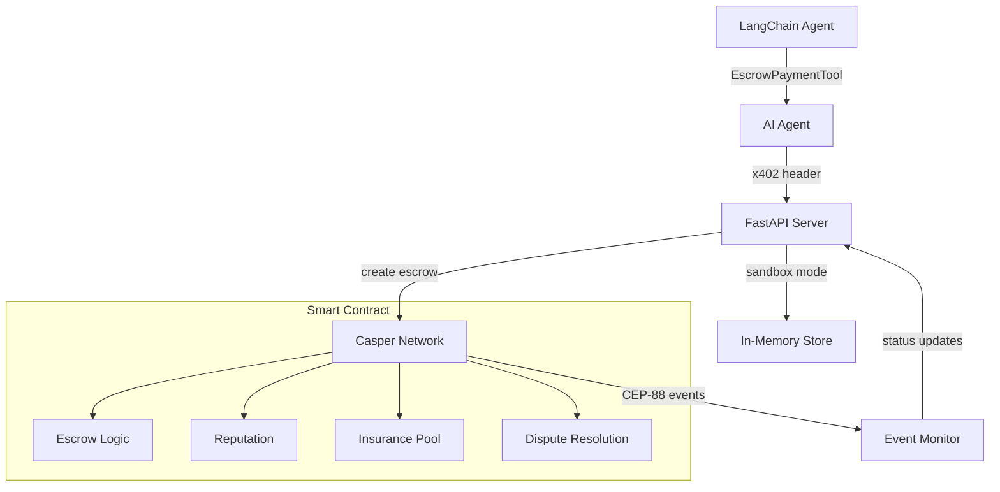
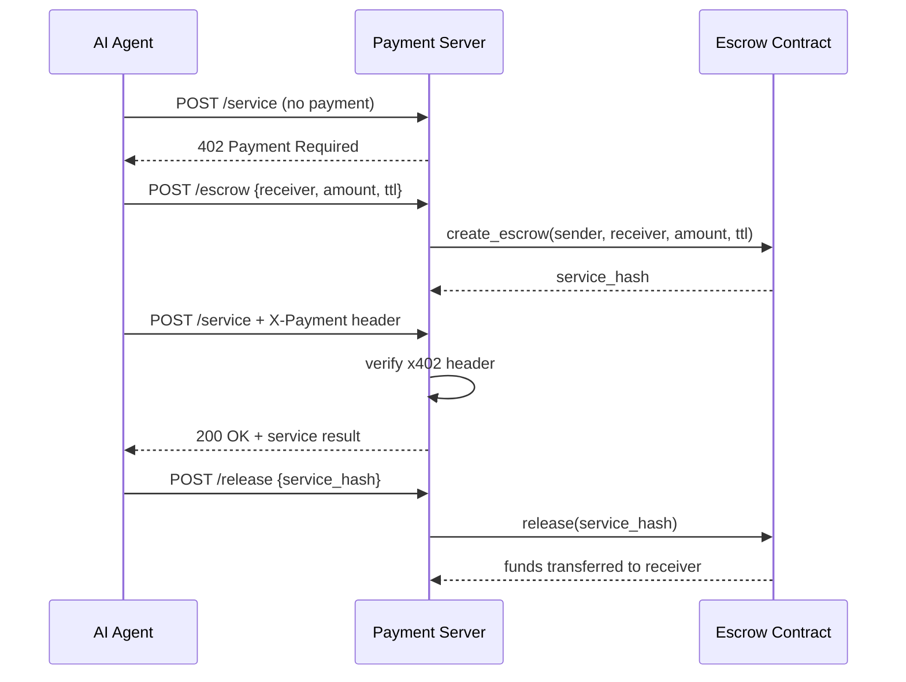
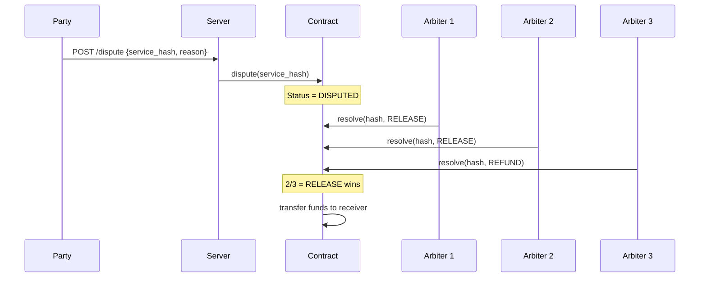
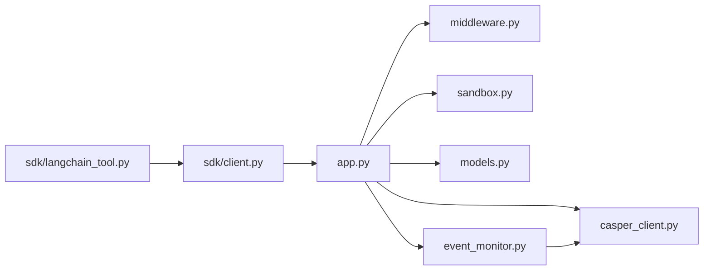

# Architecture

## System Overview

```mermaid
graph TB
    A[AI Agent] -->|x402 header| B[FastAPI Server]
    B -->|create escrow| C[Casper Network]
    B -->|sandbox mode| D[In-Memory Store]
    C -->|CEP-88 events| E[Event Monitor]
    E -->|status updates| B

    subgraph Smart Contract
        C --> F[Escrow Logic]
        C --> G[Reputation]
        C --> H[Insurance Pool]
        C --> I[Dispute Resolution]
    end

    J[LangChain Agent] -->|EscrowPaymentTool| A
```

## Payment Flow

```mermaid
sequenceDiagram
    participant Agent as AI Agent
    participant Server as Payment Server
    participant Contract as Escrow Contract

    Agent->>Server: POST /service (no payment)
    Server-->>Agent: 402 Payment Required

    Agent->>Server: POST /escrow {receiver, amount, ttl}
    Server->>Contract: create_escrow(sender, receiver, amount, ttl)
    Contract-->>Server: service_hash

    Agent->>Server: POST /service + X-Payment header
    Server->>Server: verify x402 header
    Server-->>Agent: 200 OK + service result

    Agent->>Server: POST /release {service_hash}
    Server->>Contract: release(service_hash)
    Contract-->>Server: funds transferred to receiver
```

## Dispute Resolution

```mermaid
sequenceDiagram
    participant P as Party
    participant S as Server
    participant C as Contract
    participant A1 as Arbiter 1
    participant A2 as Arbiter 2
    participant A3 as Arbiter 3

    P->>S: POST /dispute {service_hash, reason}
    S->>C: dispute(service_hash)
    Note over C: Status = DISPUTED

    A1->>C: resolve(hash, RELEASE)
    A2->>C: resolve(hash, RELEASE)
    A3->>C: resolve(hash, REFUND)
    Note over C: 2/3 = RELEASE wins
    C->>C: transfer funds to receiver
```

## Module Dependencies

```mermaid
graph LR
    app[app.py] --> middleware[middleware.py]
    app --> casper[casper_client.py]
    app --> sandbox[sandbox.py]
    app --> models[models.py]
    app --> monitor[event_monitor.py]
    monitor --> casper
    sdk_client[sdk/client.py] --> app
    langchain[sdk/langchain_tool.py] --> sdk_client
```
