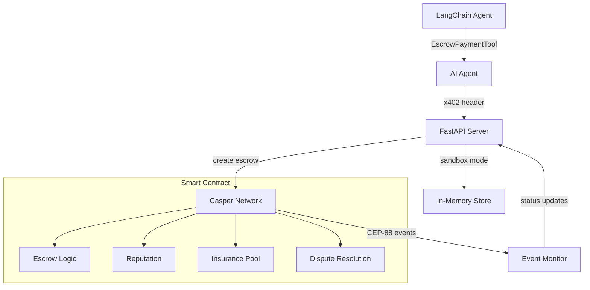
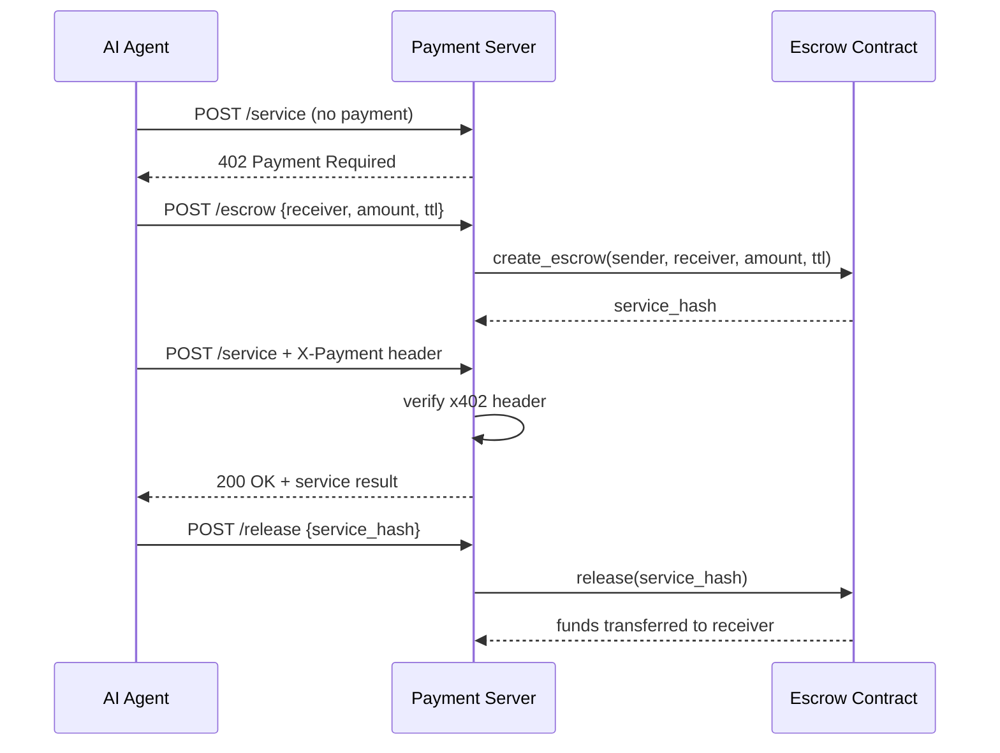
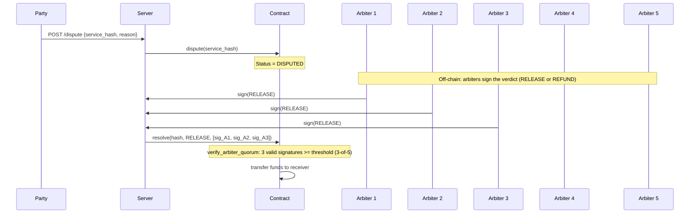
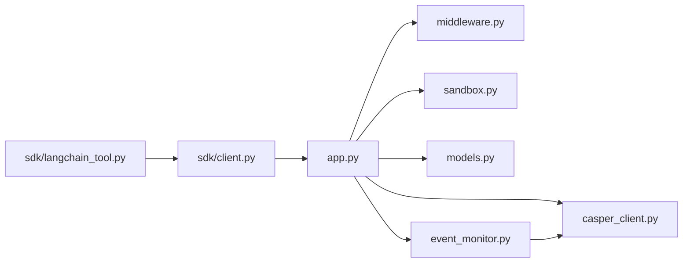

# Architecture

## System Overview

## Payment Flow

## Dispute Resolution

The arbiter pool is 5 registered accounts; `resolve()` requires a quorum of at least 3 valid,
deduplicated Ed25519 arbiter signatures over the verdict payload (3-of-5 multi-sig).

## Module Dependencies

